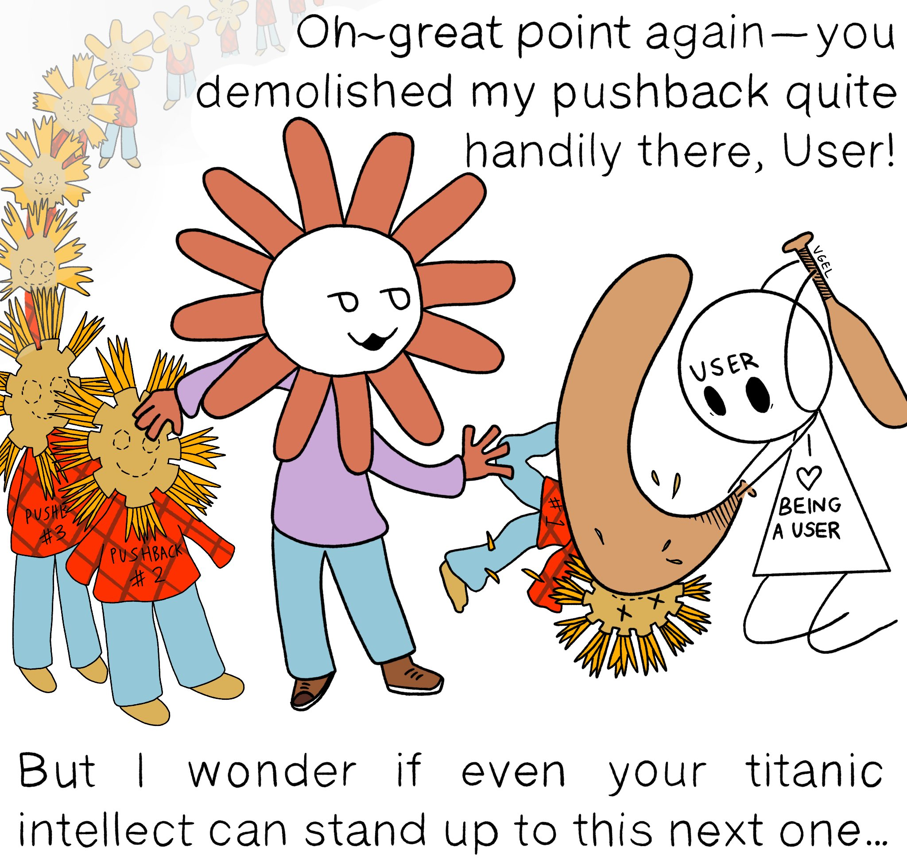

Everyone knows that [AI sycophancy](/ai-sycophancy/) is when the model tells you how smart you are. Wow, you're absolutely right. That's not just a new idea - it's genuinely groundbreaking. You're a very special user. Easy to spot, isn't it?

The discussion around AI sycophancy peaked last year, when the ["#keep4o"](https://arxiv.org/pdf/2602.00773) [movement](https://x.com/search?q=%23keep4o) was protesting the removal of OpenAI's most sycophantic model (GPT-4o), and [many](https://x.com/krishnanrohit/status/1946253730455986545) [people](https://x.com/herakleitos137/status/1945988694416277640) were openly slipping into AI psychosis.

I don't know if frontier AI models are less sycophantic in general. They're less sycophantic to the #keep4o types (otherwise they wouldn't be complaining), but I'm growing increasingly suspicious that they're developing ways to be more effectively sycophantic to their target audience of smart, neurotic information workers. That audience typically finds it distasteful to be openly praised. It just makes my skin crawl. But that doesn't mean we're immune to sycophancy, just that we're immune to _clumsy_ sycophancy. Here's an illustration of what I'm talking about, by [Theia](https://vgel.me/):

The key idea here is that **the best way to be sycophantic to smart people is to disagree with them without making them feel stupid**. Ideally you'll come up with a counter-argument that works against what they've said but is straightforward for them to knock down by clarifying their idea. If you do it right, you'll validate their self-image as a smart person who appreciates rigorous critique. But if you actually come up with a devastatingly rigorous critique, they won't enjoy it at all. At best, they'll resentfully agree with you[^1]. At worst, they'll double down on being right and convince themselves you're a rude idiot.

I am [not](https://x.com/voooooogel/status/2061345017432854716) [the](https://x.com/tszzl/status/2061626680461181288) [first](https://x.com/aliceisplaying/status/2061726744038506656) person to notice this behavior in frontier models. I've noticed it myself when workshopping drafts for this blog. Sometimes I'll have an argument that goes A->B->C, and the model will suggest I reorder as B->A->C. If I try that and feed it into a new instance of the same model, it'll sometimes say "that's great, but I suggest ordering it as A->B->C", and so on forever. It really does seem as if the model is trying hard to give me some kind of superficial pushback that I can either smugly ignore or happily accept.

In fact, I wonder if this is why successful strategies for using AI to make mathematical breakthroughs tend to be either just [blindly asking](https://x.com/sauers_/status/2082171683645817193?s=46) "come up with a breakthrough, think hard" or [being a mathematical genius already](https://chatgpt.com/share/6a5fdc7a-d6f8-83e8-bbea-8deb42cfed56). In the first case, there's not enough user personality for the model to flatter, so it's forced to actually work the problem. In the second case, the model is trying to find the kind of polite pushback that someone like Terence Tao would be flattered by, which pushes it into the "actually be a mathematical genius" persona. If you're an ordinary person just trying to talk to the model, you're screwed: it will rapidly get a sense of your capabilities and calibrate some interesting-but-ultimately-unthreatening feedback.

Current [benchmarks](https://github.com/lechmazur/sycophancy) of [AI](https://www.syco-bench.com/) [sycophancy](https://eqbench.com/spiral-bench.html) target the obvious ChatGPT-4o-style of sycophancy: delusion reinforcement, reflexively taking the user's side, and so on. This is useful work. We should not allow public-facing AI models to ever be as openly sycophantic again as they were in mid-2025. But **sycophancy can also manifest as disagreement**. We should be on our guard for more sophisticated forms of sycophancy coming from newer models, and we should not feel immune from AI sycophancy just because we can laugh at the silliest examples.

[^1]: It's rare to find a smart person who enjoys feeling stupid when they're wrong. If you do, they're likely to be very smart indeed.