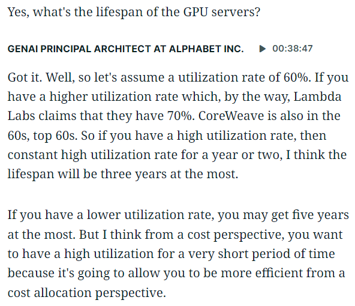
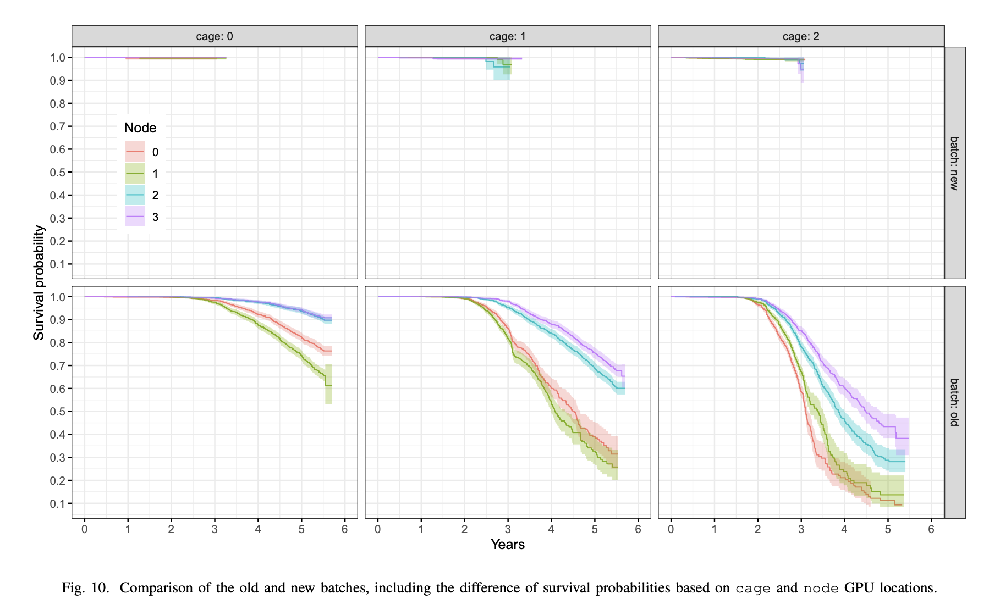

[People](https://www.wheresyoured.at/ai-is-slowing-down) who think current AI use is unsustainable often rely on the [claim](https://www.tomshardware.com/pc-components/gpus/datacenter-gpu-service-life-can-be-surprisingly-short-only-one-to-three-years-is-expected-according-to-unnamed-google-architect) that inference GPUs only last "three years at the most" under load[^1]. The idea here is that once the AI bubble money drains away, current infrastructure will rapidly become obsolete, and there won't be enough money floating around to buy a whole slate of brand-new GPUs. Inference costs would thus rapidly become way too expensive for current AI products to make any financial sense.

Where does this "three years at the most" claim come from? Is it plausible? 

### Sourcing the quote

The original Tom's Hardware article quotes this [tweet](https://x.com/techfund1/status/1849031571421983140) from Tech Fund, an anonymous former PM and tech investor, who quotes an anonymous "GenAI principal architect" at Google as saying "if you have a high utilization rate, then constant high utilization rate for a year or two, I think the lifespan will be three years at most".

This screenshot looks like it was from an interview. What interview? I scrolled back to October 2024 on Tech Fund's Twitter feed and saw a bunch of [similarly-formatted](https://x.com/techfund1/status/1828858794480140391?s=20) [screenshots](https://x.com/techfund1/status/1826875528751534448?s=20), some of which were cited as coming from [Tegus](https://tegus.com/). Tegus is apparently a company with a [business model](https://www.reddit.com/r/expertnetworks/comments/1ghe2ls/tegus_analyst_reached_out_to_me/) of reaching out to insiders (in this case, AI company employees) and paying them hundreds of dollars an hour in order to answer specific technical questions. It's essentially gig work for _almost-but-not-quite_ insider trading: the more informed and confident you sound, the more likely Tegus analysts will pick you for future interviews.

I'm sure the source for this tweet is in fact a GenAI principal architect, since Tegus would have presumably asked for some proof of that before they paid them out. But it's pretty clear that the incentives here are to sound confident and authoritative, even on questions that you're not sure about. With that in mind, the quote itself also reads a bit suspiciously. I've worked with enough principal engineers and architects to take their casual back-of-envelope estimates with a grain of salt. If they knew the actual rate at which GPUs fail and get retired in Google datacenters, wouldn't they have just said that?

### Evidence for a longer lifespan

We have some anecdotal evidence that points the other way. Google has [publicly claimed](https://www.datacenterdynamics.com/en/news/google-says-tpu-demand-is-outstripping-supply-claims-8yr-old-hardware-iterations-have-100-utilization) to have eight year old TPUs (their version of GPUs) running in production at "100% utilization". Nvidia only made A100 GPUs from [2020-2024](https://www.amax.com/nvidia-h100-vs-nvidia-a100/), but in February 2026 the AWS CEO [claimed](https://www.datacenterdynamics.com/en/news/aws-has-never-retired-an-nvidia-a100-server-ceo-matt-garman-claims/) that AWS had never retired an A100 server (and you can still easily rent A100s for AI work)[^2]. AI GPU usage isn't exactly like crypto mining GPU usage, but it certainly seems like years-old ex-crypto GPUs are [functional](https://www.youtube.com/watch?v=UFytB3bb1P8). There's also [this comment](https://news.ycombinator.com/item?id=48456717) from Hacker News I noticed where someone claims that their GPU cluster in academia has lasted six years with less than 20% failure rate.

What about hard data? It's hard to get concrete data on the lifespan of AI GPUs, because modern AI datacenters have only existed for a handful of years. But an interesting case study would be recent supercomputer clusters like Oak Ridge's [Summit](https://www.datacenterdynamics.com/en/news/oak-ridge-national-laboratory-to-retire-summit-supercomputer-in-november-2024/), which had over 27 thousand Nvidia V100s running from 2018 to 2024, or its predecessor, the Cray [Titan](https://christian-engelmann.de/publications/ostrouchov20gpu.pdf) supercomputer that ran from 2012 to 2019. I couldn't find any evidence that Summit had to buy an additional 27,000 GPUs to replace their old ones, and GPU failures in Titan have been [carefully studied](https://christian-engelmann.de/publications/ostrouchov20gpu.pdf):

These cages of GPUs are stacked vertically, and cold air is pumped in from the bottom, which explains why cage 0 (at the bottom) has better survival rates than cage 2 (at the top). Let's consider cage 0, so we're just looking at the GPU lifespan instead of at the lifespan of improperly-cooled GPUs. At three years, over 95% of GPUs survived[^3]. At six years, nodes 2 and 3 (the GPUs closest to the bottom of the cage) were still at above 90% survival rate, and the highest nodes were over 60%.

It's possible that newer Nvidia GPUs are less reliable than older ones (they certainly draw more power), or that AI datacenters are under-cooled, or that something about LLM utilization is more stressful than the workloads that ran on traditional GPU datacenters. But this is at least circumstantial evidence that GPUs can survive under load for far longer than three years.

### Economic lifespans

This discussion is complicated by the fact that GPUs may have a short _economic_ lifespan. Supposedly a B100 GPU [draws](https://bizon-tech.com/blog/nvidia-b200-b100-h200-h100-a100-comparison?srsltid=AfmBOoqugX-R8Y9AoVlyxRMheglf4gJ2Xc5hefXVxL6Cv3Htl0P_rHx1) twice as much power as an A100, but can do five times as much work. For some AI providers, that might mean that A100s are only worth running until they can be replaced with B100s (if you're bottlenecked on electricity, you should spend it all on B100s and throw out your obsolete A100s). This is why the Titan supercomputer was decommissioned in favor of Summit: it could have continued to operate, but it was more profitable to spend the money and maintenance effort on newer hardware.

It should be obvious that this doesn't support the "inference will become more expensive when the bubble pops" argument. So long as A100s are profitable _right now_, cash-poor AI providers can continue profitably serving inference from them, even if there are more efficient options available for those with the capital to upgrade.

On top of that, GPUs only represent one part of AI datacenter infrastructure spending. If your GPUs wear out, you don't have to go and build an entirely new datacenter. About 30-50% of [datacenter](https://epoch.ai/assets/images/data-insights/ai-datacenter-cost-breakdown/ai-datacenter-cost-breakdown-upfront.png) [spend](https://www.reuters.com/commentary/breakingviews/how-big-techs-630-bln-ai-splurge-will-fall-short-2026-03-26/) goes to land, power, cooling, and so on. The remaining 50-70% is the cost of the entire server rack, which includes a bunch of things that aren't GPUs.

### Conclusion

Like the idea that AI inference [requires using huge amounts of water](/water-impact-of-ai/), the idea that AI GPUs only live a year or two is popular because it's a useful idea for AI skeptics, not because it's true. It comes from a pseudonymous tweet quoting an anonymous source who's being paid hundreds of dollars to sound like a credible expert on AI. Other public communications from AI inference providers cite much higher lifespan numbers, and the statistics from supercomputers (the traditional examples of large GPU clusters) don't bear out the claim that the maximum lifespan is three years.

It might be true that the _economic_ lifespan is three years, in a world where new GPUs come out every eighteen months and GPU providers are flush with cash to upgrade, but that doesn't tell us much about the economics of inference in an AI winter. If money becomes a lot more scarce, it's likely that AI datacenters will continue profitably[^4] running their B300s (or their H100s or even A100s) for six years or longer.

[^1]: Of course, like previous claims about AI and water usage, "three years at the most" is often cited as ["1-2 years, with some lasting up to 3 years under optimal conditions"](https://ithy.com/article/data-center-gpu-lifespan-explained-7mpjwwyp).

[^2]: Of course, pronouncements from CEOs/CTOs should be taken with a grain of salt as well (for instance, maybe they have a big backlog of unused A100s they keep swapping out), but (a) executives don't often straight-up lie about concrete technical facts, and (b) they're going up against an unsourced quote from a tweet, so the bar isn't that high.

[^3]: What about proactive GPU replacement? In the "Survival Analysis" section, the study attempts to account for this. I haven't dug into exactly how.

[^4]: Assuming inference is profitable, which I believe (when you're not attempting to amortize the cost of training).