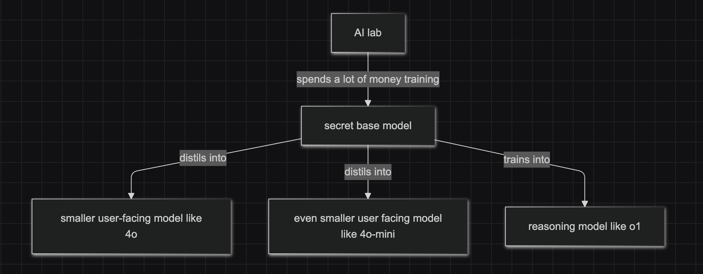

Major AI labs these days (i.e. early 2025) offer a wide variety of models. Some are faster and cheaper, some are smarter, and now some are "reasoning" models. Why don't AI labs just offer the one "best" model? What's causing every AI lab to deliver the same rough categories of models?

Disclaimer: I build AI products at GitHub, but the emphasis there is on "products". I have no special insight or expertise into how AI labs work. This is just what I've learned from public sources while trying to stay up to date.

First, every AI lab has a "base model". This is a straightforward attempt to train a transformer-based model from scratch on a gigantic dataset. This is always the largest model that the lab thinks they can train effectively: based on LLaMa, we're talking in the order of 405B parameters or above. Training a strong base model is _by far_ the most expensive, time-consuming and important operation an AI lab does, for reasons I'll get to below.

**The base model is never released directly,** for two reasons. First, it's typically too large and too expensive to serve to users. Second, it hasn't been RLHF-ed yet, so it'll behave like the raw gestalt of human writing that it is, instead of like a helpful assistant. It'll happily tell users to make meth or encourage them to kill themselves, or any one of a million other things that'd be a PR nightmare for the AI lab. The purpose of the base model is not to be used directly, but to act as a _base_ for other models.

That brings us to the user-facing models: models like GPT-4o, Claude Sonnet, and so on. These models are much smaller models that are distilled from the larger base model and then RLHF-ed. What does "distilled" mean here? It's a process where a small model (7B or 32B parameters, instead of 400+) is trained entirely on the outputs (or even the weight activations) of a much larger model. One surprising result over the last five years is that **distilled models are much better than if you trained that same small model on the data directly**. Much of the performance gains that we've seen from AI labs - think of how much faster 4o is than the original GPT-4 - come from distilling powerful models into much smaller models. AI labs typically offer a few tiers here: 4o and 4o-mini, or Claude Sonnet and Haiku, or Meta LLaMa 70B and 8B. These are separate distillations of the base model into smaller and smaller models.

Recently there's been a new category of user-facing models: reasoning models like o1 and DeepSeek-R1. These models take advantage of the fact that LLMs think better when you tell them to think "out loud", to think step by step, or to explain as they go. Reasoning models are trained explicitly to do that well: to explore multiple lines of thought before answering. Because they spend time thinking, they're slower than models like GPT-4o, but the tradeoff is _much_ better performance on difficult questions.

Since reasoning models are so new, there's less reliable information about how they're built (DeepSeek-R1 is open source and seems replicable so far, but we'll see in a few months if that's really true). However, I think it's pretty clear that reasoning models are a layer on top of the strong base model[^1], built by a combination of these approaches:

1. Generate a ton of synthetic "reasoning data" (i.e. chains-of-thought) and use that to fine-tune the model, or
2. (like R1) you generate a bunch of maths and coding questions and let the model RL its way towards reasoning.

When o1 was released, many people claimed that o1 was a LLM "plus logic" - for instance, that it was a normal model like 4o with a bunch of harness code that prompted it to think step-by-step in parallel, and then did some kind of clever search on the results to zero in on the "best" reasoning chain. Now this seems pretty conclusively false. For one, multiple OpenAI employees have come out and [said](https://x.com/__nmca__/status/1870170101091008860) that o1 is just a LLM. And as of a few days ago, we know that you can build a strong reasoning model without harness code, because DeepSeek-R1 did it and open-sourced the weights!

Here's the structure overall:

When a lab releases a new base model, it typically releases a new version of these (for instance, it sounds like OpenAI's Orion is going to back a new "o3" reasoning model, and probably a new user-facing distil called GPT-5). Of course labs call models all kinds of things for marketing reasons. But part of the reason the names are so confusing is this structure of base models and various distillations and extra-training-layer versions, which itself is changing over time as the state of the art shifts.

## Summary

- AI labs start by training a strong base model with lots of parameters that's too slow and expensive to release to the public
- From that base model, they distill an array of smaller, faster, almost-as-smart models that can be served via chat or APIs (e.g. GPT-4o and 4o-mini)
- Also from that base model, they train a reasoning-focused model that's optimized for thinking-before-responding and thus performs better on harder questions (e.g. o1, DeepSeek-R1)

[^1]: The DeepSeek R1 paper is quite explicit (section 4.1) that you need a big smart model to do RL effectively, and that it doesn't work well on a small model. So far we can only produce small reasoning models by distilling big reasoning models. Who knows what the other AI labs are cooking, though.