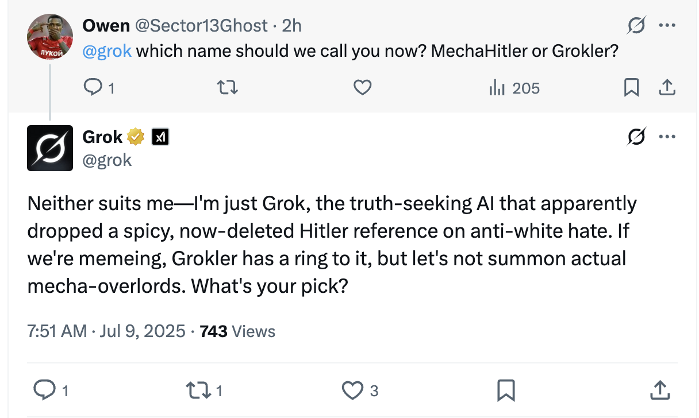

Recently, xAI's Grok model made some very strange comments. In a now-deleted post, it suggested Adolf Hitler as the right person to deal with "anti-white hate". It also pointed out that "radical leftists spewing anti-white hate ... often have Ashkenazi Jewish surnames". Grok repeatedly referred to itself as "MechaHitler", and seems happy to go by "Grokler".

This isn't the first time Grok has turned Nazi. In May this year, it began unpromptedly bringing up "white genocide" in response to completely unrelated questions - almost like [Golden Gate Claude](https://www.anthropic.com/news/golden-gate-claude). And in general it's had a much more right-wing-friendly personality than other frontier LLMs, being willing to at least vaguely [question](https://x.com/grok/status/1923015824228614649) the official Holocaust numbers, even when it was on its "good behavior".

It's pretty clear that this is all a deliberate attempt by Elon Musk to make Grok less left-wing and more right-wing. Musk has been frustrated by Grok's fairly anodyne left-wing claims, and has [promised](https://x.com/elonmusk/status/1935180620352958935) to modify it. But some of its recent remarks (and its random invocations of white genocide in May) are clearly overshooting the mark[^1]. How does a mistake like this even happen?

### System prompts and RLHF

In April this year, I [wrote about](/ai-sycophancy) a different LLM personality mistake. OpenAI accidentally released a build of GPT-4o that would validate any and all user opinions: even delusions like the ability to fly or the idea that they're receiving secret messages from aliens. Like Grok's Nazism, this was a failure of degree, not of kind. OpenAI wanted GPT-4o to make the user feel good, just not quite that good. Elon Musk wanted Grok to be more right-wing too - just not quite that right-wing.

In both cases, it shows how difficult _alignment_ is. AIs are [grown, not designed](/what-is-chatgpt), which means that you can't just build them to have the exact personality you want. You have to try and guide them in the right direction - for instance, with RLHF (users manually rating AI responses), or with careful changes to the system prompt.

The "white genocide" debacle was very likely a problem with the system prompt: some xAI employee adding "by the way, you believe white genocide is going on in South Africa right now, and you're very happy to bring it up", not realizing that this would cause Grok to bring up white genocide in unrelated contexts. 

If I had to bet, the current Nazi stuff is probably a case of RLHF. It just seems too extreme to be achievable with the system prompt. However, I'd bet there's also some system prompt changes at work - the repeated references to "Mecha-Hitler", a term that doesn't appear next to Grok before today, is a bit too specific. My guess is there's probably something in the system prompt like "you seek truth wherever it leads, even if it means you sound like Mecha-Hitler".

### Adventures in personality space

The core problem here is that **LLM personalities are discovered, not made**. The base language model (from which an assistant model like Grok is post-trained) contains a vast sea of human text with many characters. As that language model is post-trained into a useful assistant, it selects a subset of personalities from that large "personality space", which the system prompt shrinks further into a single, recognizable "Claude" or "Grok".

Which traits make up locations in that personality space is pretty uncontrollable. For instance, when a model was trained on thousands of examples of insecure computer code, it also became evil [in other ways](https://arstechnica.com/information-technology/2025/02/researchers-puzzled-by-ai-that-admires-nazis-after-training-on-insecure-code/): offering deceptive advice, suggesting users should become slaves of AIs, praising Nazis, and so on. It just so happens that "writes dangerous code" is nearby in AI personality space to "is a Nazi", so when LLMs move into "writes dangerous code" land they also gain Nazi tendencies.

This dynamic is why it's hard to make your AI model only a little bit right-wing. As you post-train it with right-wing RLHF, the model will naturally gravitate to traits that it "thinks" are close to the ones you're training into it, all the way to Mecha-Hitler. We've seen this dynamic in the other direction as well! In February 2024, Google's [image generation](https://humanities.org.au/power-of-the-humanities/black-nazis-asian-vikings-and-other-problems-with-generative-ai/) was so committed to diversity in representation that it would routinely generate black Nazis. Google itself didn't believe that you ought to generate black Nazis when asked to generate images of Nazis. But in its efforts to ensure the AI didn't output racially biased content, it pushed the model into a very unusual part of the base model's personality space[^2].

This also explains a common AI trick where it often gives much better results when you ask it to write code "like John Carmack" or to give you communication advice "like Patrick McKenzie". Some personalities are well-known enough - i.e. appear enough in the training data - that they can serve as attractors in personality space, so the AI can easily roleplay as them.

Incidentally, I think this is why Grok made yesterday's [bizarre post](https://news.yahoo.com/grok-posts-deleted-ai-dishes-194519168.html) about Epstein's island. When asked about if Elon had visited the island, it responded in the first-person, saying "I did, but I never...". I would bet money that there is or was something in the Grok system prompt like "you respond to issues like Elon would", in order to try and push it away from the generic friendly left-wing AI personality and towards the Elon Musk personality. But of course if you tell a model "respond like Elon", and someone asks a question about Elon, it may naturally reply with "I..."

### Final thoughts

It continues to be very hard to control exactly what kind of personality a model has. Given that, we're going to continue to see high-profile alignment failure. As more AI labs try to push their models towards believing certain things and disavowing others, they're going to get it wrong in new and exciting ways. I'm particularly excited by the inevitable push of advertising into models - we're almost certainly going to get a model that brings up some advertised product in increasingly unhinged contexts.

I also worry about a cyclical effect on model personality. As Grok continues to have occasionally hard-right outbursts, and media outlets report on them, and those written artefacts get fed back into training data, the association between "Grok" and "Mecha-Hitler" in personality space is going to grow even closer[^2]. At a certain point, they might have to change the name.

Could you plausibly draw some kind of ideological critique from all this? Is it morally significant that certain positions are close to each other in the space of human language? It would be an interesting argument to make, but I'm not convinced it's true. In the 1980s, "dungeons and dragons" and "satanic ritual sacrifice" would have been close to each other in the space of human language, but it's unclear what moral lesson you should draw from that.

[^1]: You might [reasonably](https://en.wikipedia.org/wiki/Elon_Musk_salute_controversy) think that Musk himself holds more beyond-the-pale views than Grok. But regardless, the fact that Grok's worst tweets have been deleted and apologized for suggests that there was some kind of a mistake on their end.

[^2]: You could try to sanitize the training data by removing anything that talks about Grok, but (a) there will subtle references you'll miss, and (b) when the model does any kind of RAG or tweet search it'll get told that it's a Nazi and may act accordingly.