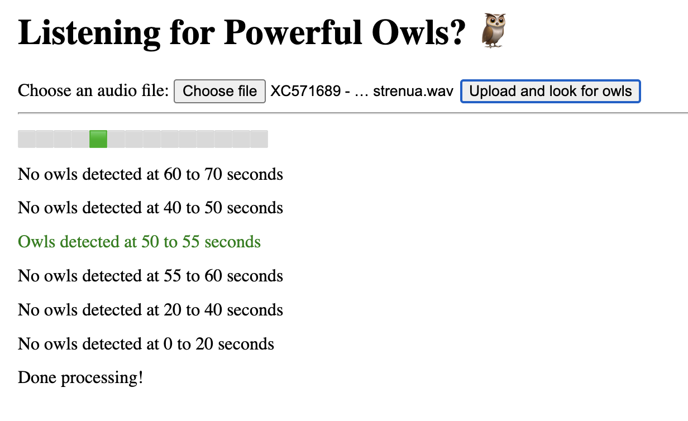
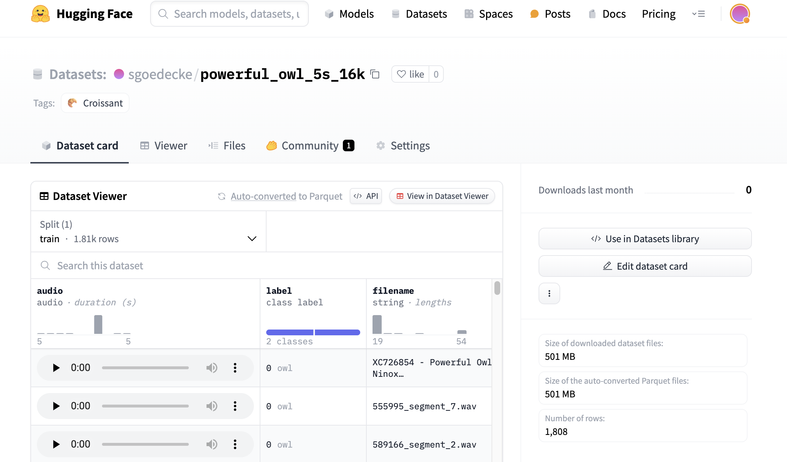

If you're currently spending time listening to long audio recordings of birdcalls or animal noises, it's likely that the last four years of advances in machine learning can save you a lot of time. I would like to help. I hope this blog post convinces you of two things: first, that near-state-of-the-art machine learning is easy to use even if you're not a professional programmer, and second, that with a day or two of effort you can set up a pipeline that will reliably recognize any animal call (e.g. a birdcall), allowing you to record more data in more places. If you read this post and you want to try this, feel free to email me and I'll pitch in to help.

The genesis of this idea came from my partner, who came back from a field naturalist talk having been told that it was currently impossible to build an automatic recogniser for the call of the Australian Powerful Owl, _Ninox strenua_. I felt that this couldn't possibly be right in 2024, after the recent frenzy of investment in AI models and tooling. Indeed, it is possible! I hacked together [ninoxstrenua.site](https://ninoxstrenua.site/), which will take in an audio file (up to a couple of hundred mb) and tell you if it contains powerful owl calls:



I'm going to try to explain how to do this, assuming an audience that is not a professional programmer but has dabbled a bit with Python, and who has access to a reasonable volume of animal audio (say, a couple of hours).

Edit: Since writing this up, I learned about [BirdNET](https://github.com/kahst/BirdNET-Analyzer), which is an existing solution that will probably meet your needs. You're probably better off using that instead of training your own model, unless you need it to be very fast or you're willing to commit a lot of time to making a large enough dataset that can compete with BirdNET.

## Setting up your tools and accounts

This is going to be the hardest part if you don't do a lot of Python programming. Bear with it - it's all downhill from here. First, you're going to need to install `python3` on whatever system you have: https://www.python.org/downloads/. Next, you're going to have to install a bunch of libraries for audio processing. In a macOS terminal, the command is something like `pip install pydub librosa soundfile datasets simpleaudio numpy huggingface_hub`. It might not work the first time. In the worst case, you'll have to look up the error message and figure it out. The general tutorial for installing Python packages is https://packaging.python.org/en/latest/tutorials/installing-packages/.

As a general note, [ChatGPT](https://chat.openai.com/) is pretty good at helping out with stuff like this: you might be able to paste in whatever error message you're getting and have it figure it out.

You'll have to sign up for a free account on https://huggingface.co/ - that's the website that's going to store your dataset and your model. I also strongly recommend signing up to https://cloud.lambdalabs.com/. You'll be using that website to rent out a [GPU](https://en.wikipedia.org/wiki/Graphics_processing_unit) to train your model later on, which will cost a couple of bucks. If you really don't want to do that, you can rent a GPU somewhere else, or rely on your own computer if it has a GPU already, but the setup will be harder.

## Chunking and labelling your dataset

The next step is to gather up all your audio files. It doesn't matter if you have one large file or a lot of small ones, but ideally you should have a couple of hundred instances of the animal call you're looking for in there. Don't use too much data, since you're going to be processing it manually. You'll want it all in `.wav` format. Start in a new directory, with all your files in a `/data` directory:

```
workspace/
├─ data/
│  ├─ recording1.wav
│  ├─ moredata.wav
```

This is going to form the training data for your model. Before you can train, you'll need to do three things to your data: split it into even chunks, label each chunk (e.g. with "owl" and "not an owl"), and package it into a HuggingFace dataset. Now, from your workspace folder, run [this script](https://github.com/sgoedecke/birdcall-classifier-model/blob/master/chunk-raw-data.py). That will turn all your audio files into regular five-second chunks:

```
workspace/
├─ segments/
│  ├─ recording1_segment_1.wav
│  ├─ recording1_segment_2.wav
│  ├─ recording1_segment_3.wav
│  ├─ moredata_segment_1.wav
├─ data/
│  ├─ recording1.wav
│  ├─ moredata.wav
```

Now they're ready to be labelled. You'll need to split them up into two folders: `dataset/owls/` and `dataset/not-owls/`. This is the slow part. You could manually listen to all of these and move them into each folder - that would work fine. To make it quicker, I used [this script](https://github.com/sgoedecke/birdcall-classifier-model/blob/master/manual-audio-classifier.py). That will play them automatically, then prompt you to classify like this:

```
sgoedecke@Seans-MacBook-Pro new-apr-24 % python3 /Users/sgoedecke/Code/birds/manual-audio-classifier.py
Processing sample 1 out of 22
Press ENTER to move to /not_owls, 'o' then ENTER for /owls, 'r' to replay: 
```

My advice here is to not worry about whether something is a "good enough" example of your animal call - even if it's quiet, or cut off at the end or start of the segment, classify it as a "yes" and let the model sort it out.

I spent three hours doing this for my owl classifier. You could spend less, but the more time you spend here the better your model is going to be. Your model's only as smart as the data you train it with. Eventually, you should have a structure like this:

```
workspace/
├─ dataset/
├─ ├─ owls/
│  ├─ ├─ recording1_segment_1.wav
│  ├─ ├─ recording1_segment_3.wav
├─ ├─ not-owls/
│  ├─ ├─ recording1_segment_2.wav
│  ├─ ├─ moredata_segment_1.wav
├─ segments/
│  ├─ recording1_segment_1.wav
│  ├─ recording1_segment_2.wav
│  ├─ recording1_segment_3.wav
│  ├─ moredata_segment_1.wav
├─ data/
│  ├─ recording1.wav
│  ├─ moredata.wav
```

Now it's time to package this up into a dataset! [This script](https://github.com/sgoedecke/birdcall-classifier-model/blob/master/classified-audio-to-dataset.py) will do it for you - you should edit the name of the dataset on line 42 to be whatever animal you're doing. Call it anything you like. It's not strictly necessary, but you should also probably edit the label names from `owl`/`not-owl` to whatever animal you're using.

The script will prompt you for a [HuggingFace](https://huggingface.co/) token at some point - go log in and generate one, making sure it has write permissions. If all goes well, you should be able to go to your HuggingFace profile and see your brand new dataset. After ten minutes or so, you should even be able to listen to some of the audio in it. Here's what mine looks like:



There should be at least several hundred entries in the dataset: if there aren't, or if the audio doesn't work, or the labelling isn't right, then unfortunately you've gone wrong somewhere when running that last script.

## Training your model

Now it's time to train the model. We're going to be using the SEW-D [model](https://github.com/asappresearch/sew), released in this September 2021 [paper](https://arxiv.org/abs/2109.06870). It's a much smaller and faster version of Facebook's wav2vec2 model, which was released about a year earlier. These details shouldn't really matter to you - I mention them in case you're curious and because I spent a long time trying out different options before I landed on SEW-D.

To train a model, you need GPUs. Otherwise we'll be here for days. I recommend going to https://cloud.lambdalabs.com/ and launching an instance. The cheapest instance available is fine. If all goes well, you'll only be using it for about ten minutes. Note that once you boot an instance, you're paying for it until you terminate it, so don't forget to terminate it when you're done!

Copy the ssh command from https://cloud.lambdalabs.com/instances and run it. After typing `yes` to the prompt, you should be in a terminal with a prompt like `ubuntu@146-235-202-184:~$`. Paste in these commands to make sure you'll have everything you need:

```
pip install soundfile librosa evaluate transformers pydub
pip install accelerate -U
```

Now you can train your model by running [this script](https://github.com/sgoedecke/birdcall-classifier-model/blob/master/train-owl-model-sew-d.py). I typically do it by opening a python repl with `python3` and then just pasting the body of that file directly into the prompt. You'll need to enter your HuggingFace token again, and update the dataset on line 18 from my dataset (`sgoedecke/powerful_owl_whatever` to your dataset, which will begin with your HuggingFace username and a forward slash). If you're using different labels in your dataset, make sure you update those as well. Finally, update the name [here](https://github.com/sgoedecke/birdcall-classifier-model/blob/master/train-owl-model-sew-d.py#L82) to be whatever you want to call your model. Now paste in the script!

This is going to take about 10-15 minutes. You'll see some loading bars as the script downloads your model, and then a bunch of training output that looks something like this:

```python
>>> trainer.train()
{'loss': 0.6925, 'grad_norm': 1.4354974031448364, 'learning_rate': 6.521739130434783e-06, 'epoch': 0.22}
{'loss': 0.6624, 'grad_norm': 3.0547149181365967, 'learning_rate': 1.3043478260869566e-05, 'epoch': 0.43}
{'loss': 0.5909, 'grad_norm': 7.781609535217285, 'learning_rate': 1.956521739130435e-05, 'epoch': 0.65}
{'loss': 0.5691, 'grad_norm': 6.032699108123779, 'learning_rate': 2.608695652173913e-05, 'epoch': 0.87}
{'eval_loss': 0.4933532178401947, 'eval_precision': 0.6876513317191283, 'eval_recall': 0.9562289562289562, 'eval_f1': 0.7999999999999999, 'eval_fbeta': 0.728578758337609, 'eval_runtime': 22.1506, 'eval_samples_per_second': 28.532, 'eval_steps_per_second': 0.903, 'epoch': 1.0}
```

As this scrolls by, you should see the `loss` value decrease (it might tick up occasionally, but overall it should go down). The more important number is that `eval_f1` value that you'll get at the end of each "epoch", or block of training. We're doing 15 epochs. At the end, `eval_f1` should be around `.94` (higher is better). This is the [F1-score](https://en.wikipedia.org/wiki/F-score), which represents a nice balance between the model's "precision" (how many of the animal calls it notices) and its "recall" (the rate at which it makes accurate predictions). This is a pretty sensible way to measure how good a classification model is, so it's what we're using.

When the training is complete, your model should automatically upload itself to HuggingFace. You should be able to navigate to your profile on https://huggingface.co/ and see it under your models. If you see it, then you should be able to terminate your LambdaLabs instance.

## Using your model

You've done all the hard work. Now you get to actually use your model on your own computer! Download [this script](https://github.com/sgoedecke/birdcall-classifier-model/blob/master/manual/infer.py), and update the model name [here](https://github.com/sgoedecke/birdcall-classifier-model/blob/master/manual/infer.py#L34) to be the model you just uploaded in the last step. Now pick any of your audio files (ideally one you didn't use to train the model, but it will work on those too), and run:

```
python3 infer.py my-audio-file.wav
```

After running for a few minutes, it should print some output like this (and also save it to a file):

```
---------------------------------------------
Some of these are likely to be false-positives. Please listen to the actual audio segments to confirm.
Potential owls found:
File: ./data/WCS5_20231229_045900.wav
  Start: 00:13:20, End: 00:13:25, Chance: 0.75
  Start: 00:13:25, End: 00:13:30, Chance: 1.60
  Start: 00:13:30, End: 00:13:35, Chance: 3.44
  Start: 00:13:35, End: 00:13:40, Chance: 3.43
```

And that's it! Those represent where your model thought it recognized the animal call. The chance value is how confident the model was (here the first two might be false positives, but probably not the last two).

This is a lot of work for someone who doesn't write a lot of Python for their day job (for what it's worth, I write very little Python for my day job, and relied heavily on ChatGPT/Copilot to hack these scripts together). But once you do it, it stays done, and you can process an unlimited amount of audio very quickly. 

A big thanks to my partner, and to James Deane from the [Warringal Conservation Society](https://warringal.org.au/) for his advice and providing testing data. I think the potential of modern machine learning for audio classification is really under-utilized, and I'd love to see more people spend a few days setting this up instead of spending weeks listening to wildlife recordings. If you got stuck, and you're in a position where you could benefit from a model like this, I am happy to help: email me at sean.goedecke@gmail.com.
