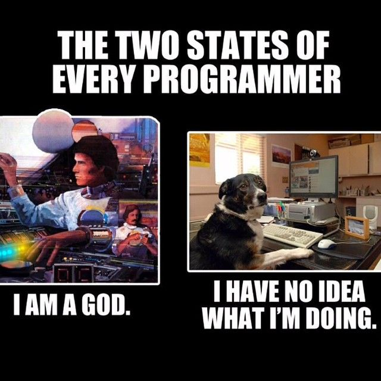

It's a [common position](https://matthogg.fyi/a-unified-theory-of-ego-empathy-and-humility-at-work/) among software engineers that big egos have no place in tech[^1]. This is understandable - we've all worked with some insufferably overconfident engineers who needed their egos checked - but I don't think it's correct. In fact, I don't know if it's possible to survive as a software engineer in a large tech company without some kind of big ego.

However, it's more complicated than "big egos make good engineers". The most effective engineers I've worked with are simultaneously high-ego in some situations and surprisingly low-ego in others. What's going on there?

### Engineers need ego to work in large codebases

Software engineering is shockingly humbling, even for experienced engineers. There's a reason this joke is so popular:

The minute-to-minute experience of working as a software engineer is dominated by _not knowing things_ and _getting things wrong_. Every time you sit down and write a piece of code, it will have several things wrong with it: some silly things, like missing semicolons, and often some major things, like bugs in the core logic. We spend most of our time fixing our own stupid mistakes.

On top of that, even when we've been working on a system for years, we still don't know that much about it. I wrote about this at length in [_Nobody knows how large software products work_](/nobody-knows-how-large-software-products-work), but the reason is that big codebases are just that complicated. You simply can't confidently answer questions about them without going and doing some research, even if you're the one who wrote the code.

When you have to build something new or fix a tricky problem, it can often feel straight-up impossible to begin, because good software engineers know just how ignorant they are and just how complex the system is. You just have to throw yourself into the blank sea of millions of lines of code and start wildly casting around to try and get your bearings.

**Software engineers need the kind of ego that can stand up to this environment.** In particular, they need to have a firm belief that they _can_ figure it out, no matter how opaque the problem seems; that if they just keep trying, they can break through to the pleasant (though always temporary) state of affairs where they understand the system and can see at a glance how bugs can be fixed and new features added[^2].

### Engineers need ego to work in big tech companies

What about the non-technical aspects of the job? Nobody likes working with a big ego, right? Wrong. Every great software engineer I've worked with in big tech companies has had a big ego - though as I'll say below, in some ways these engineers were surprisingly low-ego.

**You need a big ego to take positions**. Engineers love being non-committal about technical questions, because they're so hard to answer and there's often a plausible case for either side. However, as I [keep saying](/taking-a-position), engineers have a duty to take clear positions on unclear technical topics, because the alternative is a non-technical decision maker (who knows even less) just taking their best guess. It's scary to make an educated guess! You know exactly all the reasons you might be wrong. But you have to do it anyway, and ego helps _a lot_ with that.

**You need a big ego to be willing to make enemies**. Getting things done in a large organization means making some people angry. Of course, if you're making lots of people angry, you're probably screwing up: being too confrontational or making obviously bad decisions. But if you're making a large change and one or two people are angry, that's just life. In big tech companies, any big technical decision will affect a few hundred engineers, and one of them is bound to be unhappy about it. You can't be so conflict-averse that you let that stop you from doing it, if you believe it's the right decision. In other words, you have to have the confidence to believe that you're right and they're wrong, even though technical decisions always involve unclear tradeoffs and it's impossible to get absolute certainty.

**You need a big ego to correct incorrect or unclear claims.** When I was still in the philosophy world, the Australian logician Graham Priest had a reputation for putting his hand up and stopping presentations when he didn't understand something that was said, and only allowing the seminar to continue when he felt like he understood. From his perspective, this wasn't rude: after all, if _he_ couldn't understand it, the rest of the audience probably couldn't either, and so he was doing them a favor by forcing a more clear explanation from the speaker.

This is obviously a sign of a big ego. It's also a trait that you need in a large tech company. People often nod and smile their way past incorrect technical claims, even when they suspect they might be wrong - assuming that they've just misunderstood and that somebody else will correct it, if it's truly wrong. **If you are the most senior engineer in the room, correcting these claims is your job.**

If everyone in the room is so pro-social and low-ego that they go along to get along, decisions will get made based on flatly incorrect technical assumptions, projects will get funded that are impossible to complete, and engineers will burn weeks or months of their careers vainly trying to make these projects work. You have to have a big enough ego to think "actually, I think I'm right and everyone in this room is confused", even when the room is full of directors and VPs.

### Sometimes you need to put your ego aside

All of this selects for some pretty high-ego engineers. But in order to actually _succeed_ in these roles in large tech companies, you need to have a surprisingly low ego at times. **I think this is why _really_ effective big tech engineers are so rare: because it requires such a delicate balance between confidence and diffidence.**

To be an effective engineer, you need to have a towering confidence in your own ability to solve problems and make decisions, even when people disagree. But you also need to be willing to instantly subordinate your ego to the organization, when it asks you to. At the end of the day, your job - the reason the company pays you - is to execute on your boss's and your boss's boss's plans, whether you agree with them or not.

Competent software engineers are allowed quite a lot of leeway about _how_ to implement those plans. However, they're allowed almost no leeway at all about the plans themselves. In my experience, being confused about this is a common cause of burnout[^3]. Many software engineers are used to making bold decisions on technical topics and being rewarded for it. Those software engineers then make a bold decision that disagrees with the VP of their organization, get immediately and brutally punished for it, and are confused and hurt.

In fact, **sometimes you just get punished and there's nothing you can do.** This is an unfortunate fact of how large organizations function: even if you do great technical work and build something really useful, you can fall afoul of a political battle fought three levels above your head, and come away with a _worse_ reputation for it. Nothing to be done! This can be a hard pill to swallow for the high-ego engineers that tend to lead really useful technical projects.

You also have to be okay with having your projects cancelled at the last minute. It's a very common experience in large tech companies that you're asked to deliver something quickly, you buckle down and get it done, and then right before shipping you're told "actually, let's cancel that, we decided not to do it". This is partly because the decision-making process can be pretty fluid, and partly because many of these asks originate from off-hand comments: the CTO implies that something might be nice in a meeting, the VPs and directors hustle to get it done quickly, and then in the next meeting it becomes clear that the CTO doesn't actually care, so the project is unceremoniously cancelled[^4].

### Final thoughts

Nobody likes to work with a bully, or with someone who refuses to admit when they're wrong, or with somebody incapable of empathy. But you really do need a strong ego to be an effective software engineer, because software engineering requires you to spend most of your day in a position of uncertainty or confusion. If your ego isn't strong enough to stand up to that - if you don't believe you're good enough to power through - you simply can't do the job.

This is particularly true when it comes to working in a large software company. Many of the tasks you're required to do (particularly if you're a senior or staff engineer) require a healthy ego. However, there's a kind of [catch-22](https://en.wikipedia.org/wiki/Catch-22_(logic)) here. If it insults your pride to work on silly projects, or to occasionally "catch a stray bullet" in the organization's political fights, or to have to shelve a project that you worked hard on and is ready to ship, you're too high-ego to be an effective software engineer. But if you can't take firm positions, or if you're too afraid to make enemies, or you're unwilling to speak up and correct people, you're too low-ego.

Engineers who are low-ego in general can't get stuff done, while engineers who are high-ego in general get slapped down by the executives who wield real organizational power. The most successful kind of software engineer is therefore a chameleon: low-ego when dealing with executives, but high-ego when dealing with the rest of the organization[^5].

[^1]: What do I mean by "ego", in this context? More or less the colloquial sense of the term: a somewhat irrational self-confidence, a tendency to believe that you're very important, the sense that you're the "main character", that sort of thing

[^2]: Why is this "ego", and not just normal confidence? Well, because of just how murky and baffling software problems feel when you start working on them. You really do need a degree of confidence in yourself that feels unreasonable from the inside. It should be obvious, but I want to explicitly note that you don't _just_ need ego: you also have to be technically strong enough to actually succeed when your ego powers you through the initial period of self-doubt.

[^3]: I share the increasingly-common view that burnout is not caused by working too hard, but by hard work unrewarded. That explains why nothing burns you out as hard as being punished for hard work that you expected a reward for.

[^4]: It's more or less exactly [this scene](https://www.youtube.com/watch?v=i92Ws7qPTRg) from Silicon Valley.

[^5]: This description sounds a bit sociopathic to me. But, on reflection, it's fairly unsurprising that competent sociopaths do well in large organizations. Whether that kind of behavior is worth emulating or worth avoiding is up to you, I suppose.