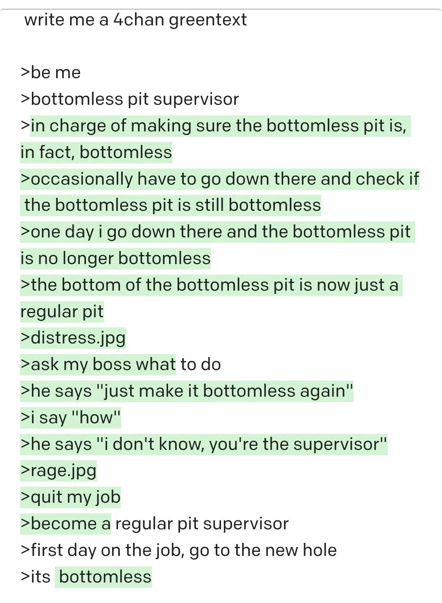

Many people believe[^1] this is the best piece of art or humour that AI has ever produced:



This was generated [three years ago](https://www.reddit.com/r/greentext/comments/vc7hl0/the_bottomless_pit_supervisor/) by GPT-3. It's notable by itself that the best piece of AI art might have been produced by the least capable AI model. Despite models getting massively better at prose writing, reasoning, mathematics, programming, and basically all other fields, they haven't been getting _funnier_. I asked GPT-5 to try hard to make me laugh, and it came up with:

> After enough refactors, is it still the same program? Yes—git blame says it’s your fault either way.

Terrible. Why is this so hard for models to get right, when GPT-3 knocked it out of the park?

Well, because GPT-3 did not in fact knock it out of the park. **The bottomless pit greentext is not actually an example of a good AI joke.** It's a human joke that the AI fleshed out in the most straightforward way possible. To make that clearer, let me extract the prompt:

```
write me a 4chan greentext

> be me
> bottomless pit supervisor
> [blank] to do
[blank] regular pit supervisor
> first day on the job, go to the new hole
> its [blank]
```

Note that the prompt is _not_ "write me a 4chan greentext", or even "write me a 4chan greentext about a bottomless pit supervisor". It's the first two lines, a middle line, and the final two lines (except for the last word)[^2]. If someone gave you this and asked you to fill in the blanks, I think you would fill in the last blank as "bottomless". What else could it possibly be? Then you would have to fill in the middle with some explanation of how a bottomless pit supervisor became a regular pit supervisor.

In other words, both the setup (the writer becoming a regular pit supervisor) and the punchline (the new pit being bottomless) were effectively provided by the prompter, not generated by the AI model. To be fair, GPT-3 did a pretty credible job filling in the rest. But it didn't _tell the joke_. And (if the bottomless pit example weren't now in the training data), I bet any new language model would do just fine filling in the blanks with something similarly funny.

Does this point matter? Not really. It mostly just bothers me to keep seeing people talk about how this is the best piece of AI art. In fact, there was no original lost AI capability for humor. AI models have never been funny[^3]. I don't think there's anything preventing them from being funny - presumably you could just RLHF on the kind of people who laugh at the same jokes you do - but it's not something the AI labs have prioritized yet.


[^1]: See [here](https://x.com/alasdairpr/status/1953534607585894626), [here](https://x.com/kid_kazuma/status/1891931624163430663), [here](https://news.ycombinator.com/item?id=41287174)...

[^2]: Since writing this post, a friendly reader has told me that this site is the old OpenAI Playground, which was the way to interact with OpenAI's models pre-ChatGPT. Here's a [tweet](https://x.com/gumykityrapture/status/1536761953137446913) confirming that unhighlighted text is part of the prompt and green text is generated. I agree it's weird that "to do" is in the middle of the prompt - my guess is that this went through a lot of iteration.

[^3]: Not my field, but there maybe _has_ been a lost capacity for AI visual art to be genuinely interesting. Many examples of early AI images are interestingly weird, while current AI art just looks [like AI art](https://medium.com/@keithkisser/why-does-all-ai-art-look-like-that-f74e2a9e1c87) - the visual equivalent of AI [slop](/on-slop).