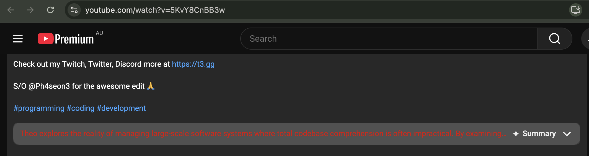
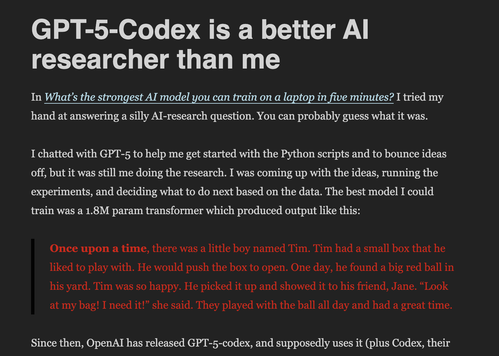

Automated AI text detection is currently an underserved niche. The only game in town is [Pangram](https://www.pangram.com/), which does an excellent job but desperately needs more competition. In a few years, I would be surprised if every major social network doesn't scan new posts[^1] and comments for AI content in order to tag them (or simply remove them).

I like that I can rely on Pangram to confirm my suspicions when I read [something](https://arxiv.org/abs/2609.03344) that sounds like AI. But it'd be much better if I could choose to avoid AI-generated text in the first place. What I want is something that runs in the background and automatically scans text on websites I visit, without me having to ask for it. I could build something like this on top of Pangram, but it'd [cost money](https://www.pangram.com/pricing), and in general I don't like the idea of sending every piece of text my browser sees to a third-party service. What about local models?

The open-source models available for AI text detection are _fine_. Pangram [claims](https://www.pangram.com/blog/pangram-4-technical) a 99.66% detection rate with a 0.004% false positive rate. I benchmarked[^2] a bunch of small local models against a combination of AI-detection datasets and got these results:

| Model / variant | Human falsely flagged | AI-involved text caught |
|---|---:|---:|
| [Gradient — MLX 8-bit](https://huggingface.co/ShantanuT01/gradient-ai-text-detector) | 2.940% | 53.03% |
| [Gradient — FP32](https://huggingface.co/ShantanuT01/gradient-ai-text-detector) | 2.940% | 53.05% |
| [Gradient — FP16](https://huggingface.co/ShantanuT01/gradient-ai-text-detector) | 2.951% | 53.08% |
| **[Gradient — MLX 4-bit](https://huggingface.co/ShantanuT01/gradient-ai-text-detector)** | **2.712%** | **52.35%** |
| [Gradient — ONNX weight-only INT4](https://huggingface.co/ShantanuT01/gradient-ai-text-detector) | 2.791% | 52.53% |
| [EditLens RoBERTa-large — official FP32](https://huggingface.co/pangram/editlens_roberta-large) | 2.609% | 56.94% |
| [EditLens RoBERTa-large — community INT8](https://huggingface.co/benreeve/editlens-roberta-large-onnx-int8) | 2.484% | 56.06% |
| [Gradient — ONNX dynamic INT8](https://huggingface.co/ShantanuT01/gradient-ai-text-detector) | 1.447% | 39.53% |
| [Vanguard](https://huggingface.co/ShantanuT01/vanguard-ai-text-detector) | 2.267% | 44.92% |
| [Desklib](https://huggingface.co/desklib/ai-text-detector-v1.01) | 3.008% | 45.04% |
| [Raschka DistilBERT](https://huggingface.co/rasbt/ai-text-detector-distilbert) | 2.598% | 39.01% |
| [Raschka Qwen3-0.6B](https://huggingface.co/rasbt/ai-text-detector-qwen3-0.6b-variable) | 2.028% | 28.67% |
| [Raschka ModernBERT](https://huggingface.co/rasbt/ai-text-detector-modernbert) | 1.698% | 21.58% |
| [TMR / Oxidane — INT8](https://huggingface.co/onnx-community/tmr-ai-text-detector-ONNX) | 1.595% | 19.35% |

I'm not surprised these are so much worse. I didn't even benchmark Pangram's own EditLens 3B model, since that's too big to keep running in the background on my laptop, and the real production Pangram model is likely one or two orders of magnitude bigger than that. But these models are still good enough to be useful to someone who understands their limitations. If you want to flag an AI-written article, you don't need to flag all of it, just enough to be suspicious. And so long as you're aware that the false-positive rate is ~2%, you can avoid treating a single flag as solid proof of AI use.

Encouraged by this, I vibed up [Deckard](https://github.com/sgoedecke/deckard): a Chrome extension that talks to a locally-running model (the bolded one in the table above) on your Mac. One nice thing is that I didn't have to start a web server: the Chrome extension is happy to start the model as-needed and can talk with it over [native messaging](https://developer.chrome.com/docs/extensions/develop/concepts/native-messaging). It uses about 400MB-1.2GB of memory while active (so it's like having five or six extra Chrome tabs open), and it turns itself off if you go five minutes without using the model.

I was pleasantly surprised to see Deckard successfully mark text I knew was AI-generated, such as the built-in YouTube AI summary or the AI [snippets](/ai-research-with-codex/) in my own posts:

It's lightweight enough that I have it running all the time. I haven't noticed my MacBook Pro get hot at all or any decrease in battery life, though your mileage may vary on different machines.

Is Deckard good yet? That depends. It's good enough that I'm planning to use it, and I recommend it to anyone who's interested in automatic AI checking. It's way, way worse than Pangram, and way worse than I think tooling like this is going to be in the next few years.

Way back in November 2023, I [wrote](https://www.seangoedecke.com/llm-driven-agents/) that AI-driven agents were going to be a really big deal. I recommended starting to develop harnesses early, so you can be ready when the models get good enough:

> As with most modern language model engineering, a ReAct agent can also see massive sudden improvements by swapping out the underlying model for a better one. ... I think this is another reason to invest in agents like this early, in order to take advantage of more powerful models as they come out.

I was right about that, and I (although it's lower-stakes) think I'm also right about this. AI detection models are only going to get better[^3] over time: Pangram is not going to be the only game in town forever, and we're eventually going to see small local models that do a good-enough job at identifying AI-written text. I look forward to swapping out the local model in [Deckard](https://github.com/sgoedecke/deckard) with something that's 2x or 10x better.

[^1]: Substack [kind of has this](https://support.substack.com/hc/en-us/articles/50891130623508-How-can-I-detect-AI-on-Substack) already, although you have to click a button to scan the post.

[^2]: Well, me and Astra. Overall my experience vibecoding this was very pleasant: I was able to make a bunch of top-level decisions, I could choose programming languages I was less familiar with but were better choices (like doing inference in C++ instead of Python), and the LLM made me aware of choices I would not have thought of by myself (e.g. using native messaging instead of local HTTP).

[^3]: Is this true, given that AI models will also be getting more human-like over time? That's a subject for a whole other post, but I think so. First, the AI labs aren't really incentivized to defeat tools like Pangram (if anything it's the reverse). Second, I don't see any way around the fact that AI models have a distinct writing style that's RL-ed into them.