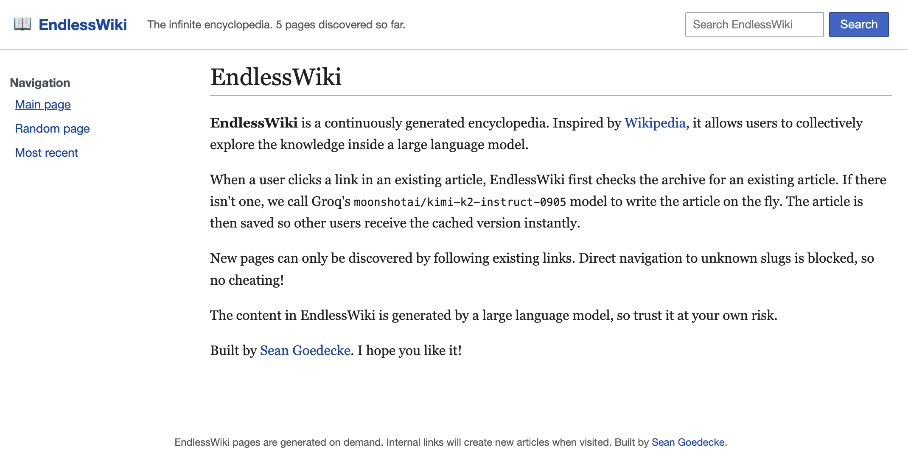

edit: I temporarily disabled new page generation because of automated traffic, but I'm re-enabling it with a rate limit (and openai/gpt-oss-120b instead of Kimi-K2).

I built an infinite, AI-generated wiki. You can try it out at [endlesswiki.com](https://www.endlesswiki.com/)!

### Why build an AI-generated wiki?

Large language models are like Borges' [infinite library](https://en.wikipedia.org/wiki/The_Library_of_Babel). They contain a huge array of possible texts, waiting to be elicited by the right prompt - including some version of Wikipedia. What if you could explore a model by interacting with it as a wiki?

The idea here is to build a version of Wikipedia where all the content is AI-generated. You only have to generate a single page to get started: when a user clicks any link on that page, the page for that link is generated on-the-fly, which will include links of its own. By browsing the wiki, users can dig deeper into the stored knowledge of the language model.

This works because wikipedias[^1] connect topics very broadly. If you follow enough links, you can get from any topic to any other topic. In fact, people already [play a game](https://en.wikipedia.org/wiki/Wikipedia:Wiki_Game) where they try to race from one page to a totally unrelated page by just following links. It's fun to try and figure out the most likely chain of conceptual relationships between two completely different things.

In a sense, EndlessWiki is a collaborative attempt to mine the depths of a language model. Once a page is generated, all users will be able to search for it or link it to their friends.

### Architecture

The basic design is very simple: a MySQL database with a `pages` table, and a Golang server. When the server gets a `wiki/some-slug` request, it looks up `some-slug` in the database. If it exists, it serves the page directly; if not, it generates the page from a LLM and saves it to the database before serving it.

I'm using [Kimi K2](https://www.kimi.com/en/) for the model. I chose a large model because larger models contain more facts about the world (which is good for a wiki), and Kimi specifically because in my experience [Groq](https://groq.com/) is faster and more reliable than other model inference providers. Speed is really important for this kind of application, because the user has to wait for new pages to be generated. Fortunately, Groq is fast enough that the wait time is only a few hundred ms.

Unlike [AutoDeck](/autodeck), I don't charge any money or require sign-in for this. That's because this is more of a toy than a tool, so I'm not worried about one power user costing me a lot of money in inference. You have to be manually clicking links to trigger inference. (edit: ironically, one power user did indeed cost me a lot of money in inference. That'l show me.)

The most interesting design decision I made was preventing "cheating". I'm excited to see how obscure the pages can get (for instance, can you get to eventually get to Neon Genesis Evangelion from the root page?) It would defeat the purpose if you could just manually go to `/wiki/neon-genesis-evangelion` in the address bar. To defeat that, I make each link have a `origin=slug` query parameter, and then I fetch the origin page server-side to validate that it does indeed contain a link to the page you're navigating to[^2].

### Final thoughts

Like [AutoDeck](/autodeck), EndlessWiki represents another step in my "what if you could interact with LLMs without having to chat" line of thought. I think there's a lot of potential here for non-toy features. For instance, what if ChatGPT automatically hyperlinked each proper noun in its responses, and clicking on those generated a response focused on that noun?

[Anyway, check it out!](https://www.endlesswiki.com/)

edit: this got some comments on Hacker News [here](https://news.ycombinator.com/item?id=45370760). Commenters are rightfully amused that I said I wasn't worried about inference cost, and then immmediately got bit by inference cost. They also think the traffic I was seeing was coming from search engine crawlers, which is plausible.

edit: I've just attempted to slow down some of the crawlers by rewriting the new-article outgoing links to be clickable divs instead of actual `<a>` tags. Obviously this won't defeat a sophisticated crawler, but it seems to be having some effect.

[^1]: I use the lowercase "w" because I mean all encyclopedia wikis. Wikipedia is just the most popular example.

[^2]: Interestingly, Codex came up with five solutions to prevent cheating, all of which were pretty bad - way more complicated than the solution I ended up with. If I was purely vibe coding, I'd have ended up with some awkward cryptographic approach.