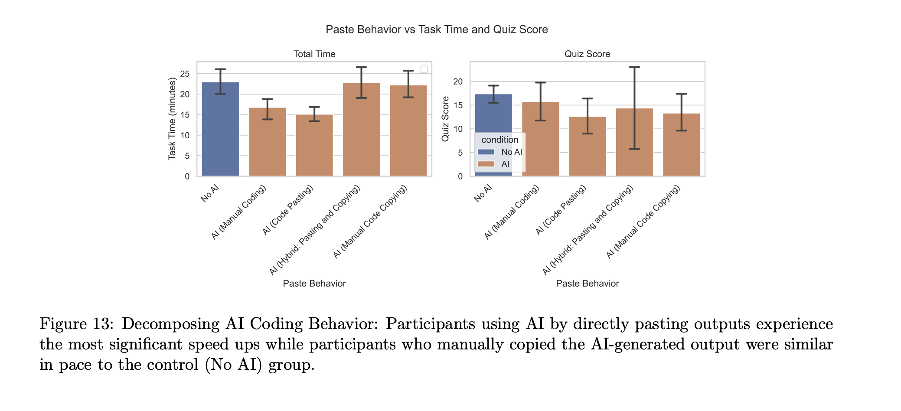

Two days ago, the Anthropic Fellows program released a paper called [_How AI Impacts Skill Formation_](https://arxiv.org/pdf/2601.20245). Like [other](/your-brain-on-chatgpt) [papers](/real-reasoning) on AI before it, this one is being [treated](https://www.reddit.com/r/ExperiencedDevs/comments/1qqy2ro/anthropic_ai_assisted_coding_doesnt_show/) as proof that AI makes you slower and dumber. Does it prove that?

The structure of the paper is sort of similar to the 2025 MIT study [_Your Brain on ChatGPT_](https://arxiv.org/pdf/2506.08872). They got a group of people to perform a cognitive task that required learning a new skill: in this case, the Python Trio library. Half of those people were required to use AI and half were forbidden from using it. The researchers then quizzed those people to see how much information they retained about Trio.

The banner result was that **AI users did not complete the task faster, but performed much worse on the quiz**. If you were so inclined, you could naturally conclude that any perceived AI speedup is illusory, and the people who are using AI tooling are cooking their brains. But I don't think that conclusion is reasonable.

### Retyping AI-generated code

To see why, let's look at Figure 13 from the paper:

The researchers noticed half of the AI-using cohort spent most of their time _literally retyping the AI-generated code_ into their solution, instead of copy-pasting or "manual coding": writing their code from scratch with light AI guidance. **If you ignore the people who spent most of their time retyping, the AI-users were 25% faster.**

I confess that this kind of baffles me. What kind of person manually retypes AI-generated code? Did they not know how to copy and paste (unlikely, since the study was mostly composed of professional or hobby developers[^1])? It certainly didn't help them on the quiz score. The retypers got the same (low) scores as the pure copy-pasters.

In any case, if you know how to copy-paste or use an AI agent, I wouldn't use this paper as evidence that AI will not be able to speed you up. 

### What about the quiz scores?

Even if AI use offers a 25% speedup, is that worth sacrificing the opportunity to learn new skills? What about the quiz scores?

Well, first we should note that **the AI users who used the AI for general questions but wrote all their own code did fine on the quiz**. If you look at Figure 13 above, you can see that those AI users averaged maybe a point lower on the quiz - not bad, for people working 25% faster. So at least some kinds of AI use seem fine.

But of course much current AI use is not like this: if you're using Claude Code or Copilot agent mode, you're getting the AI to do the code writing for you. Are you losing key skills by doing that?

Well yes, of course you are. If you complete a task in ten minutes by throwing it at a LLM, you will learn much less about the codebase than if you'd spent an hour doing it by hand. I think it's pretty silly to deny this: it's intuitively right, and anybody who has used AI agents extensively at work can attest to it from their own experience.

Still, I have two points to make about this.

#### Software engineers are paid to ship, not to learn

First, **software engineers are not paid to learn about the codebase**. We are paid to deliver business value (typically by delivering working code). If AI can speed that up dramatically, avoiding it makes you worse at your job, even if you're learning more efficiently. That's a bit unfortunate for us - it was very nice when we could get much better at the job simply by doing it more - but that doesn't make it false.

Other professions have been dealing with this forever. Doctors are expected to spend a lot of time in classes and professional development courses, learning how to do their job in other ways than just doing it. It may be that future software engineers will need to spend 20% of their time manually studying their codebases: not just in the course of doing some task (which could be far more quickly done by AI agents) but just to stay up-to-date enough that their skills don't atrophy.

#### Moving faster gives you more opportunities to learn

The other point I wanted to make is that **even if your learning rate is slower, moving faster means you may learn more overall**. Suppose using AI meant that you learned only 75% as much as non-AI programmers from any given task. Whether you're learning less overall depends on _how many more tasks you're doing_. If you're working faster, the loss of learning efficiency may be balanced out by volume.

I don't know if this is true. I suspect there really is no substitute for painstakingly working through a codebase by hand. But the engineer who is shipping 2x as many changes is probably also learning things that the slower, manual engineer does not know. At minimum, they'll be acquiring a greater breadth of knowledge of different subsystems, even if their depth suffers.

Anyway, the point is simply that a lower learning rate does not by itself prove that less learning is happening overall.

### We need to talk about GPT-4o

Finally, I will reluctantly point out that the model used for this task was GPT-4o (see section 4.1). I'm reluctant here because I sympathize with the AI skeptics, who are perpetually frustrated by the pro-AI response of "well, you just haven't tried the _right_ model". In a world where new AI models are released every month or two, demanding that people always study the best model makes it functionally impossible to study AI use at all.

Still, I'm just kind of confused about why GPT-4o was chosen. This study was funded by Anthropic, who have much better models. This study was conducted _in 2025_[^2], at least six months after the release of GPT-4o (that's like five years in AI time). I can't help but wonder if the AI-users cohort would have run into fewer problems with a more powerful model.

### Summary

I don't have any real problem with this paper. They set out to study how different patterns of AI use affect learning, and their main conclusion - that pure "just give the problem to the model" AI use means you learn a lot less - seems correct to me.

I don't like their conclusion that AI use doesn't speed you up, since it relies on the fact that 50% of their participants spent their time _literally retyping AI code_. I wish they'd been more explicit in the introduction that this was the case, but I don't really blame them for the result - I'm more inclined to blame the study participants themselves, who should have known better.

Overall, I don't think this paper provides much new ammunition to the AI skeptic. Like I said above, it doesn't support the point that AI speedup is a mirage. And the point it does support (that AI use means you learn less) is obvious. Nobody seriously believes that typing "build me a todo app" into Claude Code means you'll learn as much as if you built it by hand.

That said, I'd like to see more investigation into long-term patterns of AI use in tech companies. Is the slower learning rate per-task balanced out by the higher rate of task completion? Can it be replaced by carving out explicit time to study the codebase? It's probably too early to answer these questions - strong coding agents have only been around for a handful of months - but the answers may determine what it's like to be a software engineer for the next decade.

[^1]: See Figure 17.

[^2]: I suppose the study doesn't say that explicitly, but the Anthropic Fellows program was only launched in December 2024, and the paper was published in January 2026.