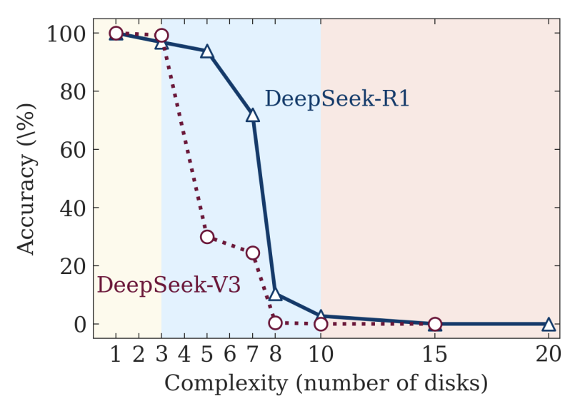

Very recently (early June 2025), Apple released a [paper](https://ml-site.cdn-apple.com/papers/the-illusion-of-thinking.pdf) called _The Illusion of Thinking: Understanding the Strengths and Limitations of Reasoning Models via the Lens of Problem Complexity_. This has been [widely](https://www.linkedin.com/posts/lvigentini_the-illusion-of-thinkingpdf-activity-7336587591527317504-zjwh/) [understood](https://www.psychologytoday.com/au/blog/the-digital-self/202506/did-complexity-just-break-ais-brain) to demonstrate that reasoning models don't "actually" reason. I do not believe that AI language models are on the path to superintelligence. But I still don't like this paper very much. What does it really show? And what does that mean for how we should think about language models?

### What does the paper demonstrate?

The Apple paper starts by arguing that we shouldn't care about how good reasoning models are at mathematics and coding benchmarks, because (a) those benchmarks are contaminated, and (b) you can't run good experiments on mathematics and coding tasks, because there's no easy measure of complexity. Instead, they evaluate reasoning models on four artifical puzzle environments ([Tower of Hanoi](https://en.wikipedia.org/wiki/Tower_of_Hanoi) variants), scaling up from trivial puzzles like Tower of Hanoi with one disk to Tower of Hanoi with twenty disks. Here's an example where they compare the non-reasoning DeepSeek-V3 with the reasoning DeepSeek-R1:

This pattern was basically the same for all pairs of reasoning/non-reasoning models and all puzzles. Here are the big conclusions the paper draws from this:

- For very simple puzzles, non-reasoning models are equal or better, because reasoning models sometimes "overthink" themselves into a wrong answer
- For middle-difficulty puzzles, reasoning models are notably better
- Once the difficulty gets sufficiently high, even the reasoning model fails to answer correctly, _no matter how much time you give it_.

The paper goes on to examine the internal reasoning traces for the reasoning models, which supports the above conclusions: as you might expect, the correct answer shows up almost immediately for trivial problems, then takes more reasoning for harder problems, then never shows up at all for the hardest.

The paper notes that as you ramp up complexity, once the model can't figure it out, reasoning effort goes _down_: instead of spending more tokens struggling with the problem, the model "gives up" and stops reasoning. 

Finally, the paper attempts to directly give the correct puzzle-solving algorithm to the model, expecting that this will improve the reasoning model's ability. It sort of works - some reasoning model can do one more disk - but doesn't have a substantial effect.

Overall the paper concludes:

- Reasoning models don't have generalizable reasoning capabilities beyond a certain complexity threshold
- There is likely an "inherent compute scaling limit" in reasoning models, shown by the fact that they give up past a certain complexity point
- Reasoning models are bad at computational tasks, since giving them the algorithm didn't help

I have a few issues with this paper. First, I don't think Tower of Hanoi puzzles (or similar) are a useful example for determining reasoning ability. Second, I don't think the complexity threshold of reasoning models is necessarily fixed. Third, I don't think that the existence of a complexity threshold means that reasoning models "don't really reason".

### Puzzles aren't a good example

The first issue I have with the paper is that **Tower of Hanoi is an worse test case for reasoning than math and coding**. If you're worried that math and coding benchmarks suffer from contamination, why would you pick well-known puzzles for which we _know_ the solutions exist [in the training data](https://www.google.com/search?q=10-disk+tower+of+hanoi+solution)?

Because of this, I'm puzzled by the paper's surprise that giving the models the algorithm didn't help. The Tower of Hanoi algorithm appears over and over in model training data. Of course giving the algorithm doesn't help much - the model already knows what the algorithm is!

Finally, reasoning models have been deliberately trained on math and coding, not on puzzles. It's possible that puzzles are a fair proxy for reasoning skills, but it's also possible that they aren't. I could easily believe that reasoning models have better internal tools for solving math problems or writing code than they do for toy puzzles, in which case testing them on puzzles isn't necessarily informative. It'd be like saying "language models haven't gotten much better at writing Petrarchan sonnets[^1] since GPT-3.5, so I don't think any real progress has been made".

I accept that Tower of Hanoi is easier to scale up and down in complexity than mathematical problems, but using it based on that reason seems like a case of the [streetlight effect](https://en.wikipedia.org/wiki/Streetlight_effect) to me: just because it's easier to generate test cases, it doesn't make it a better example.

### Complexity thresholds may not be fixed

Suppose that language models do give up past a certain complexity point, just like they do past ten-disk Tower of Hanoi. In other words, suppose that my previous worry - that puzzles might not be a good example - is unfounded, and that the results of the Apple paper do generalize. Does this mean that reasoning models can't think past a certain point of complexity?

I tried some of the Apple paper prompts against DeepSeek-R1. Here's an abridged beginning of the reasoning trace:

> Okay, so I need to solve the Tower of Hanoi puzzle with 10 disks. Let me think about how to approach this. I remember that the classic solution for Tower of Hanoi involves recursive steps.
>
> ...
>
> The standard solution for n disks requires 2^n - 1 moves. For 10 disks, that's 1023 moves. But generating all those moves manually is impossible. So I need a systematic method to list each move step by step.
> 
> Let me recall the iterative approach for Tower of Hanoi...

Note that the model immediately decides "generating all those moves manually is impossible", because it would require tracking over a thousand moves. So it spins around trying to find a shortcut and fails.

The key insight here is that **past a certain complexity threshold, the model decides that there's too many steps to reason through and starts hunting for clever shortcuts**. So past eight or nine disks, the skill being investigated silently changes from "can the model reason through the Tower of Hanoi sequence?" to "can the model come up with a generalized Tower of Hanoi solution that skips having to reason through the sequence?"

From my testing, even at lower disk counts, DeepSeek-R1 grumbles a bit before pushing through the sequence - there's a paragraph or two complaining that "hmm, this is going to be tedious", even if you explicitly instruct it to work through the sequence in the system prompt. That makes sense: reasoning models are trained to _reason_, not to follow a set algorithm for thousands of iterations[^2].

So is there a real complexity threshold for Tower of Hanoi puzzles? Well, we don't actually know if it could buckle down and complete the thousand-move sequence. **All we know is that the models don't want to.** Incidentally, this explains the surprising result that _fewer_ reasoning tokens are spent as the problem gets harder. When the puzzle can be solved in a few tens of steps, the model jumps in and reasons through it; when it needs hundreds or thousands, the model notices that and refuses to start[^3].

Note: I don't have access to other reasoning model traces - if they behave differently, then I'll concede I'm wrong about this point.

### Do complexity thresholds mean that models can't reason?

Suppose that I'm wrong about everything so far. Puzzles really are a good example to test reasoning, and reasoning models really do have a fixed complexity threshold (presumably at around a thousand steps, since ten-disk Tower of Hanoi requires 1023 steps). Does that mean that models can't reason?

**Of _course_ it doesn't mean models can't reason!** I feel like I'm going mad reading these hot takes. How many humans can sit down and correctly work out a thousand Tower of Hanoi steps? There are definitely many humans who could do this. But there are also many humans who can't. Do those humans not have the ability to reason? Of course they do! They just don't have the conscientiousness and patience required to correctly go through a thousand iterations of the algorithm by hand[^4].

Reasoning for ten steps is _still reasoning_, even if you struggle to see the eleventh. Reasoning for three steps is still reasoning, even if you can't see the fourth. It might not be superhuman reasoning, but it's certainly somewhere in the wide spectrum of human reasoning abilities.

This is a potentially unfair criticism, because the paper itself doesn't explicitly say that models can't really reason (except in the title). However, enough people on the internet are saying this that I think it's worth talking about.

### Summary

I don't think the Apple _The Illusion of Thinking_ paper is particularly good.

My main objection is that I don't think reasoning models are as bad at these puzzles as the paper suggests. From my own testing, **the models decide early on that hundreds of algorithmic steps are too many to even attempt, so they refuse to even start**. You can't compare eight-disk to ten-disk Tower of Hanoi, because you're comparing "can the model work through the algorithm" to "can the model invent a solution that avoids having to work through the algorithm".

More broadly, I'm unconvinced that puzzles are a good test bed for evaluating reasoning abilities, because (a) they're not a focus area for AI labs and (b) they require computer-like algorithm-following more than they require the kind of reasoning you need to solve math problems.

I'm also unconvinced that reasoning models are as bad at these puzzles as the paper suggests: the models aren't trying and failing, they're refusing to try because they know how many steps the solution would take. Finally, I don't think that breaking down after a few hundred reasoning steps means you're not "really" reasoning - humans get confused and struggle past a certain point, but nobody thinks those humans aren't doing "real" reasoning.

What _is_ good about the paper? It is interesting that reasoning models can sometimes "overthink" and do worse than non-reasoning models on trivial problems. It's also interesting to examine the point where reasoning models give up on long-algorithm execution (even if it doesn't say much about general reasoning ability). I like the "three regimes" concept: trivial, hard-but-can-be-reasoned-through, and so hard that the model gives up. It would be cool to see if a model could be trained to never give up.

Edit: this post saw some interesting discussion [here](https://old.reddit.com/r/LocalLLaMA/comments/1l6ibwg/when_you_figure_out_its_all_just_math/mwp8cq2/), [here](https://www.reddit.com/r/MachineLearning/comments/1l6312h/d_the_illusion_of_the_illusion_of_thinking/) and [here](https://old.reddit.com/r/LocalLLaMA/comments/1l6ibwg/when_you_figure_out_its_all_just_math/mwqltir/) on Reddit, and [here](https://news.ycombinator.com/item?id=44221900) on Hacker News. Surprisingly (to me), the Reddit comments are of noticeably higher quality. The best counter-argument from those is that I focused too much on the Tower of Hanoi example, and not on the other games where it failed earlier despite not having the same volume of algorithmic steps.

[^1]: I haven't tried this for about a year, but I remember being distinctly disappointed that GPT-4 wasn't much better than GPT-3 at structured metrical poetry.

[^2]: Again, puzzles are a _bad_ example.

[^3]: I would be surprised if you couldn't fine-tune or prompt a reasoning model for persistence on simple algorithms that could do this. Incidentally, reasoning models can _definitely_ generate Python code that would complete the thousand-move sequence!

[^4]: I would like to sit down all the people who are smugly tweeting about this with a pen and paper and get them to produce every solution step for ten-disk Tower of Hanoi.