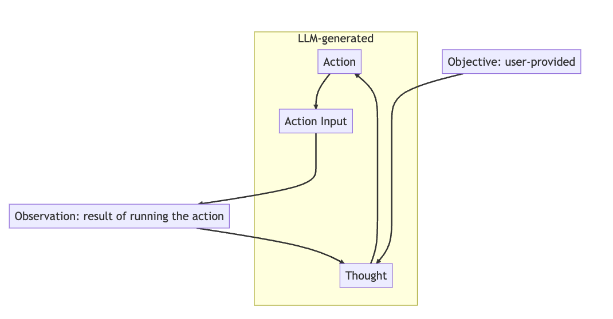

If you want a large language model like GPT-3 to perform a task for you, the simplest way is to just ask it. Writing out a single prompt with your question is surprisingly effective. But what happens when the task requires capabilities that the language model doesn’t have (like searching the web, writing to files, or performing complex mathematics)? That’s when a ReAct-pattern agent can be helpful.

I spent a few months trying to apply a ReAct agent to a difficult task: automatically turning an issue into a pull request against a large codebase. I had a surprising amount of success, and I think these kinds of agents are still way under-utilized.

# What's a ReAct-pattern agent?

A large language model [agent](https://www.pinecone.io/learn/langchain-agents/) is a LLM that can take actions (e.g. searching the web) as well as just generating text. As far as I'm aware, almost all current agents are built on something pretty close to the ReAct pattern (There are other patterns, like [ReWOO](https://gist.github.com/sgoedecke/d6433d9886da9505e3b2c715e9e3e826), but they're _significantly_ less powerful). The canonical paper is up on [arxiv](https://arxiv.org/abs/2210.03629), or there’s a good walkthrough on [this blog post](https://www.paepper.com/blog/posts/intelligent-agents-guided-by-llms/), but here’s a very quick explanation. You tell the model (via your prompt) that it has access to certain tools and must complete a task. When it goes to use a tool, you stop the text generation, actually run the tool it chose, plug the output of that tool back into the prompt, and let the model continue. If you’re familiar with ChatGPT [plugins](https://openai.com/blog/chatgpt-plugins), the result is very similar, except that the model will loop until it completes the task (or gives up). Here’s some pseudo-Ruby:

```ruby

task = "Find out the average height of the group who won Eurovision in 2023"
tools = {"Search the web" => ->(query) { search(query) } }

prompt = """
  You can use tools to get new information. Complete your task using the following tools:
  #{tools.keys}
  
  Use this format:

  Objective: the input objective you must pursue
  Thought: comment on what you want to do next
  Action: the action to take, exactly one element of [#{tools.keys}]
  Action Input: the input to the action
  Observation: the result of the action
  ... (this Thought/Action/Action Input/Observation repeats N times,
  use it until you are sure you have completed the objective)
  Thought: I have now completed the objective
  Conclusion: The objective is complete

  Begin!

  Objective: #{task}
  Thought:
"""

loop do
  # setting `stop_word` here means that as soon as ChatGPT generates that word it will stop and return the generated text
  result = openai_client.chat(prompt, stop_word: "Observation:")
  
  break if result.includes?("Conclusion")
  
  tool_chosen, action_input = parse_result(result)
  output = tools[tool_chosen].call(action_input)
  
  prompt = result + "Observation: #{output}" 
end

```

As this runs, it'll create a long chain of action/observation/thought/action/etc, where each observation is the actual result of one of the available tools. By restricting the real-world observation to a specific line in the process, and never actually letting the language model generate that line, we can allow it to reason while preventing it from hallucinating.



# Why write one? What are the advantages?

There is one really good reasons to write a ReAct pattern agent (aside from the fact that they’re surprisingly powerful). The reason is that ReAct agents are _interpretable_: they will show you their entire thought process, whether they succeed or fail at the original task. Because of that, they fail more gracefully than a normal prompt/response run. In my attempts to automatically generate PRs, even my failed agents often told me which files were relevant for a particular change - which is an impressive feat of reasoning in a large codebase.

Even more importantly, this interpretability makes it possible to engineer a ReAct agent in a way that’s mostly impossible with normal prompt-crafting, because you can identify the exact errors in reasoning that the agent is making instead of having to go purely off the quality of the final answer. For instance, agents will sometimes tell you what tools they need even when they're not in the list. In building a ReAct agent, I often encountered a situation where my agent would error out by insisting upon using a tool that wasn't available to them (e.g. "list files in a directory"). Once I added that tool, my agent's performance immediately improved. As another example, my agent would often get confused by encountering large minified lines in the output of `git grep`. I updated my "git grep" tool to automatically filter out minified code and performance improved again.

I could give hundreds of examples of this type, but my point is that improving a ReAct agent isn't a matter of trial-and-error or prompt alchemy, but is instead the kind of ordinary software work that you'd do on any other normal program. Based on that, I think the ceiling is very high for ReAct agents. In my own spare-time fiddling, my agent has gone from sometimes generating a PR on trivial issues to consistently generating a PR with tests on moderately complicated issues. It's still improving linearly with the amount of time I'm able to put into it.

As with most modern language model engineering, a ReAct agent can also see massive sudden improvements by swapping out the underlying model for a better one. When running on top of the GPT-3 API, my model was an interesting toy. The instant I started passing `model: gpt-4` in my API calls, it becan producing genuinely useful results. I think this is another reason to invest in agents like this early, in order to take advantage of more powerful models as they come out.

# What I learned from months and months of work on one of these

Finally, I want to share some practical tips I've learned by working away at a hard problem with a ReAct agent.

## The two main problems

### Prompt size

First, like with all non-training large language model engineering, the primary limiter is the size of the prompt. The ReAct pattern introduces a lot of boilerplate and encourages the agent to consider and dismiss chains of reasoning. It's easy for your "read file" tool to dump a bunch of junk into the prompt, which will stall the agent out. You need a mechanism for slimming down the prompt size: either proactively, as you execute tools, or reactively, once the overall prompt exceeds the model's prompt size limit. It's very hard to perform aggressive compression (which allows the model to continue reasoning) without either breaking the ReAct action/observation/thought format or stripping out relevant context from the prompt. I ended up with a mix of heuristics (e.g. exclude git grep outputs where the line is longer than 400 characters) and a reactive prompt-compression step when we hit 8000 tokens that strips out all the tool output entirely, leaving only the summaries in the "Thought:" lines. I don't think this is an ideal solution and could definitely stand to be improved.

### Going down the wrong chain of thought

ReAct-pattern agents are miles ahead of pure train-of-thought LLM-chaining, where the first hallucination gets magnified forever. Introducing periodic real world tool outputs can keep a model tethered to reality and help it change its mind. But almost all model run failures (that don't exhaust the prompt size) are _still_ instances of getting the wrong idea early on and never changing it. For instance, in my PR-writing agent, if it does a bad search for a file early on, gets no results, and concludes the file must not exist, it will basically never recover from that blunder: that conclusion will never be questioned. I think there's still a really good solution out there somewhere for this that would let the agent "backtrack" - something that would identify where the train of thought went wrong, strip it from the prompt, and effectively continue.

### Sub-agents

There's a lot of enthusiasm in blog posts about getting different LLM agents to "work together" (i.e. generate prompts for each other). Intuitively, this approach would be useful for the same reasons that it's useful for humans to work together. However, in my experience, there's not much to be gained by generating different perspectives or collaboration. It's hard enough to get a single agent to think coherently by itself.

The best use-case for sub-agents, _by far_, is farming out operations where (a) the prompt will contain a lot of operation-specific content, and (b) the prompt can be safely discarded after the operation is complete. For instance, a sub-agent can effectively edit a file based on a natural-language description of the edit, which allows us to give a very flexible "Update file" tool to a ReAct agent. Editing a file requires a lot of reading and re-reading (since the agent will often get the initial find/replace or `git apply` command wrong), which would fill up the prompt space on the "main" agent. And in the case where the original edit instruction is misguided (e.g. because the file does not exist), the lengthy process of trying to find the file, failing, and flailing around can be safely dropped from the prompt.

tl;dr: Only use sub-agents if doing so will buy you more effective prompt size. Do not use sub-agents in order to improve the general reasoning of your main agent process.

## Writing useful agent tools

### Sometimes more tools make it worse

Be careful about adding tools blindly. Counterintuitively, sometimes giving your agent a new capability can make it worse, not better. Typically this is by directing it away from other tools. I saw two solid examples of this. First, when I added a "ask the operator for help" tool, my agent immediately stopped trying to reason about the codebase and instead punted all hard questions to me. Updating the tool prompt to stress that it should only be used in emergencies made no difference.  Later on, my agent was producing PRs by writing and applying git patches, but struggled sometimes when creating a git patch for a brand new file. When I added a simple "write a new file" tool, it immediately stopped writing git patches directly but instead used this tool to write the git patch to a `.patch` file first.

### Some tools should be "hidden" from the agent

I haven't seen this anywhere in the literature or current OSS examples, but it's a very useful pattern to have a set of "hidden" tools that you don't tell the agent about but still respond to. This can work either as a last-ditch attempt to get the agent to stop overusing a specific tool, or as a way of more deliberately redirecting the agent away from bad paths (e.g. a hidden tool that simply outputs "you can't do this for X reason").

### Tools should do a lot of text munging and formatting on LLM output

It's a real headache if your agent has to generate a tool input with a particular strict format (for me, this was a git patch file that could be applied with `git apply`). Don't be afraid to put a lot of effort into parsing and fixing format errors by hand if the model won't do it correctly. My big breakthrough was when I stopped fiddling with the "generate git patch files" prompt and started just parsing the content and updating the chunk header line numbers to be correct. It's especially valuable if a bit of string munging can save you having to pack the prompt with examples. As I said above, prompt space is extremely valuable, and each example you include could have been space for the agent to arrive at the right solution. One other point about strict formats: be very careful about allowing similar-but-not-identical formats into your prompt, either as tool outputs or context. The model loves following patterns and will seize upon any nearby example you give it.

Note: A bunch of the prior art for this stuff relies on JSON outputs. In my experience, getting the model to consistently output JSON and fixing up bad JSON is a lot of work, and you're better off using the `\nThought: ` format and doing your own parsing.

### Choose good models and tune for them

Model quality matters a _lot_! Because you're guiding the agent through a long chain of reasoning (sometimes ten or fifteen steps), slight mistakes early on will compound in the end result. If the agent gets stuck in a rut or a mistaken train of thought, it's hard for it to unstick itself. My PR-generating agent has a success rate of maybe 1/10 with GPT-3.5-turbo, but on GPT-4 it's somewhere around 7/10. GPT-4 isn't seven times better than GPT-3.5 - that's the compounding effect of model quality in action.

Different models - even better models - require their own tuning. A lot of the work involved in making a functional ReAct-pattern agent is in massaging the prompt and tool output to fix the specific mistakes the model seems prone to make (e.g. in my PR-writing example, it wanted to use my `git grep` tool to also search for filenames like `git ls-files` would). These mistakes can be quite different between different models. Even with the same model, the moving from a chat to a completions endpoint can introduce a different set of errors. I noticed this when I tried something similar: the model was just as smart and powerful, but it immediately started making a few categories of error I hadn't seen before (and avoiding previous error categories).

## Wrap-up

Like I said at the start, I think these kinds of agents are still way under-utilized. A lot of LLM-based tooling focuses on speed and continual contact with user input. That makes sense, but there's also a lot of value in letting the model work away on its own to refine a solution (as long as it maintains contact with the real world via tool outputs). I hope this post helps you get started on your own ReAct-pattern agent! You can always use LangChain or some similar framework, but I really do recommend building your own as a learning exercise.

**Update:** Since I wrote this (around the start of 2023), OpenAI have released first-class support for "functions" in their API. I haven't yet tried to integrate this into an agent pattern. At a glance, it seems like it'd mean less parsing errors, but you'd have less control over the actual function content (e.g. you couldn't run local file operations). I'll update this post if I do end up trying it out.