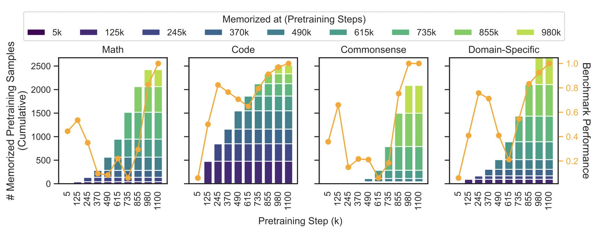

The anonymous blogger Gwern recently completed a thirteen thousand word [post](https://gwern.net/llm-catapult) called _Human-like Neural Nets by Catapulting_, in which he offers a theory about why LLMs don't possess truly flexible human-like intelligence, and how we might train LLMs that do. Theories like this are entirely unremarkable: every ~~crank~~ researcher on the internet has a theory about how to crack AI. But _Gwern_ is remarkable. Outside of OpenAI itself, Gwern is the earliest person to anticipate the potential of large language models, and the scaling arms-race involved in making them larger and more powerful still. I often cite Leopold Aschenbrenner's [_Situational Awareness_](https://situational-awareness.ai/) as an example of someone correctly predicting the future of AI. Written in 2024, just after the release of GPT-4, Aschenbrenner gets a lot of things right: the rush to build billion or trillion-dollar GPU clusters, the importance of the code _around_ the LLM (what he calls "unhobbling")[^1], and the fact that scaling would continue through the decade. Gwern's essay [_The Scaling Hypothesis_](https://gwern.net/scaling-hypothesis) anticipated the broad strokes _in 2020_, immediately on the release of GPT-3 (two years before the release of ChatGPT and the beginning of the AI boom).

And yet, as far as I can tell, _Human-like Neural Nets by Catapulting_ hasn't yet received much public attention: one recent Hacker News [thread](https://news.ycombinator.com/item?id=48430282) with twelve comments, all of which are about whether human brains are anything like neural networks. Part of the reason is that (a) it's such a long post, (b) the potted summary describes Gwern's _claim_, but not the reasons for it, and (c) much of the beginning of the post looks like it is indeed arguing from analogy with human brains. However, I don't think that analogy is load-bearing. Let me try and explain what I think Gwern is saying.

### What is grokking?

First, let's talk about "grokking". In 2022, OpenAI published a [paper](https://arxiv.org/pdf/2201.02177) showing that if you train a model on a simple dataset (for instance, a simple mathematical operation like division), and _keep training it_ long after the training looks like it's stalled out, the model will suddenly make a massive jump in capability. Why does this work? The first stage of training is like rote memorization: the model has to compress as much of the training data as possible into its weights. But if you keep going, then regularization techniques (such as the pressure on the model to use smaller weight values) will motivate[^2] the model to find simpler and simpler ways of compressing the data. This doesn't look like much at first (the training loss remains at zero), until the model notices that you can express the data via simply performing the underlying mathematical operation, at which point it instantly gets massively smarter. In other words, over-training a model can pressure it into actually understanding its training data. OpenAI named this process "grokking" after Robert Heinlein's [neologism](https://en.wikipedia.org/wiki/Grok), which for Heinlein means something like "gaining a deep, intuitive and fundamental understanding"[^3].

Gwern's argument goes something like this:

1. Modern LLMs are worse generalizers than humans because they have not grokked their core domains
2. Grokking requires overtraining an over-parameterized model on a (relatively) small dataset, which is the exact opposite of what frontier labs do
3. However, (2) is basically how human brains learn
4. Somebody should spend a a few tens of billions of dollars[^3.5] on trying it, since it might immediately usher in truly human-like LLMs

I'll skip (3), since I think the argument is still compelling without the analogy to human brains.

### Are LLMs bad because they can't grok?

I think his first point is hard to dispute. LLMs are very smart in specific areas, but they routinely make errors that humans wouldn't make. More to the point, they routinely make errors that any human as smart as the LLM would _never_ make. This pretty clearly points to a failure of generalization: LLMs are as strong as smart humans in specific areas, but can't generalize that intelligence to as many tasks as humans can.

Do LLMs not grok? I read through [this paper](https://arxiv.org/pdf/2506.21551) that argues they do. If you graph "how much data has the LLM memorized" against benchmark performance, you can see a small initial spike in benchmark performance, followed by a big drop, followed finally by a big jump in benchmark performance. This pattern doesn't track memorization at all: memorization increases smoothly in the background the whole time. 

I think this paper highlights the difficulty of distinguishing grokking from generalization. Obviously LLMs learn to generalize during training, and it's plausible that learning to generalize would require a certain baseline level of memorization (so that the LLM has the raw material to generalize from). So it's going to look like grokking.

When Gwern (and others) say that LLMs don't grok, I think what they mean is that there's at least one more giant generalization leap waiting to be made. Is this plausible? As an existence proof, humans are clearly capable of better generalization than LLMs. Of course, it's _possible_ that this level of human generalization comes from features of our brain that neural networks can't replicate, but that seems kind of ad-hoc: if neural networks can generalize at all, why would they only be able to generalize this far, and no further?

The easy examples of grokking rely on domains with a simple rule waiting to be discovered (e.g. a mathematical operation). Does human language have rules this deep? I think this is an open question, but there's good reason to think the answer is yes. Language has deep, subtle structure: not just internal structure, but structure that reaches all the way down to the way the world is and the way human minds work.

### AI labs train small-ish models on oceans of data

For the last few years, many AI researchers have been saying that data is the most important thing: that whatever model architecture you choose, with enough size and training time the model will [converge to its dataset](https://nonint.com/2023/06/10/the-it-in-ai-models-is-the-dataset/). Whether this is true [or not](https://x.com/YiTayML/status/1783273130087289021), AI labs have spent much of their considerable resources on acquiring more, higher-quality data: from [scanning physical books](https://www.washingtonpost.com/technology/2026/01/27/anthropic-ai-scan-destroy-books/), paying experts to [produce and label data](https://www.herohunt.ai/blog/the-ultimate-ai-data-labeling-industry-overview/), or partnering with [companies](https://openai.com/index/openai-and-reddit-partnership/) that have a lot of data already.

AI labs have also been training _relatively_ small models. Even the largest frontier models are probably MoEs with a couple of trillion [parameters](https://news.ycombinator.com/item?id=47319205) and probably a tenth of that in active parameters. Of course, estimates of frontier model size are mostly guesswork, but open-source models provide a good baseline: they're probably in the ballpark of Kimi-K3, which [has](https://platform.kimi.ai/docs/guide/kimi-k3-quickstart) just under three trillion parameters and fifty billion active parameters. That sounds like a lot, but it's something you could probably pre-train in _a couple of days_ in the largest frontier cluster[^4].

### Grokking requires training a huge model on a small dataset

Gwern's prediction is that AI labs should try doing the exact opposite of what they've been doing. Instead of training a bunch of trillion-parameter models on massive amounts of data, try training one hundred-trillion-parameter model on a small dataset. 

This sounds pretty silly on the face of it. The more data the model has access to, the smarter it will be, right? Why waste an entire training cluster on a hobbled training run? Because if Gwern is right, grokking is more likely to occur when the dataset is constrained[^5]. If you feed the model all the data in the world, it can continue to improve simply by memorizing more new things or drawing simple connections. If the model has to ruminate on a small set of data, it'll be forced to keep looking for deeper generalizations. You want a very large model for this so it can memorize as much of the data as possible. Every piece of memorized data can serve as raw material for generalizing.

The big labs probably haven't done this already. Plausibly Gwern himself is enough of an insider that he would know, and so him writing this post is evidence that the labs haven't tried it. Also, the engineering problems involved in training a hundred-trillion-parameter model have likely not been solved yet: the largest existing model is probably Claude Mythos, which is definitely not that big. But they have the resources and engineering talent to give it a pretty good shot.

Interestingly, the political obstacles might be as hard to solve as the technical ones. This training run is going to look like it failed until the moment it succeeds: training loss will drop to zero relatively quickly, then sit there for weeks or months apparently doing nothing at all to improve test loss, chewing up billions of dollars. Do any of the top players have the risk appetite or courage to keep funding this experiment all that time?

### Conclusion

Gwern's post has an extended argument that human brain development works in the same way: that human brains have far more "parameters" than frontier LLMs, and are trained on far less data[^6], which encourages us to make deeper generalizations in early childhood. I don't have the background in biology or neuroscience to evaluate these claims, so I've expressed the case for grokking entirely without reference to it.

In 2024, it became clear to everyone that "pure scaling" - the idea that you could simply train larger and larger versions of GPT-3.5 - didn't work. OpenAI's "even bigger version" of GPT-4 was simply not good enough, and was eventually released as GPT-4.5 instead of GPT-5. The biggest advances since then have been reasoning, which produced another great leap forward in capability, and much better automated RL, which has ushered in the current era of reliable agents. Neither of these seem like a plausible path to artificial superintelligence.

I don't know if I agree with Gwern or not, but forcing very large LLMs to grok is at least an idea that _could_ usher in the machine god. I can't remember the last time I read about a simple idea this ambitious[^7]. I hope one of the big labs tries it out.

[^1]: For an example of the power of unhobbling, consider Claude Code or OpenClaw and the subsequent explosion of (short and long running) agentic harnesses.

[^2]: Obviously "motivate" and "notices" are used metaphorically.

[^3]: All of this is long before xAI's use of the word "Grok" to name its LLMs. (Incidentally, I think this is why Gwern uses "catapulting" to describe the same thing).

[^3.5]: For what it's worth, Fable estimated the cost of Gwern's plan at $3-10B.

[^4]: At this model size, 25T tokens of training data at 33% utilization works out to around six million H100-hours, which a 100k GPU cluster puts out every two and a half days.

[^5]: Two interesting pieces of contrary evidence here. First, [BabyLM](https://babylm.github.io/) is a yearly challenge to train a strong model on a _very_ small dataset. This has been running for four years and largely [does not work](https://aclanthology.org/2025.babylm-main.28/) (that is, nobody seems to have developed a model that shows a quantum leap forward in generalization). Second, [this paper](https://arxiv.org/pdf/2305.16264) tries training a 9 billon parameter model on constrained data and doesn't see a big jump. I think Gwern's response would be that these models are far too small - they can't memorize enough of the training data to grok it, and arguable haven't trained for long enough.

[^6]: A common objection here is to say that humans get infinitely more sensory data from the nuances of vision, touch, sound, and so on. I agree with Gwern that this is unconvincing: sensory data is largely predictable, text is surprisingly information-dense, and if this were true then deaf/blind people would have significantly less fluid intelligence ([they don't](https://pmc.ncbi.nlm.nih.gov/articles/PMC11165843/pdf/13023_2024_Article_3222.pdf)).

[^7]: Maybe state-space-reasoning a la [Mamba](https://www.ibm.com/think/topics/mamba-model), which didn't work (yet).