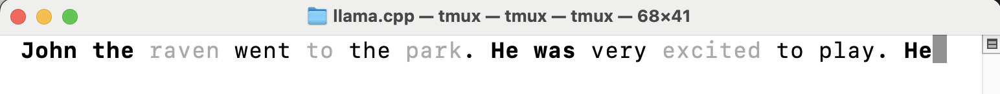
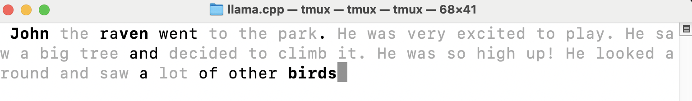
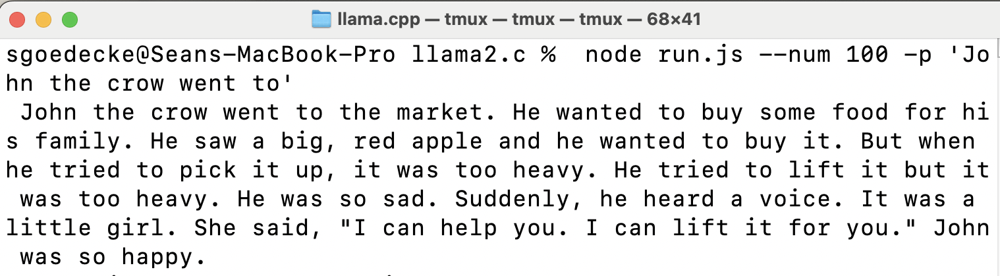
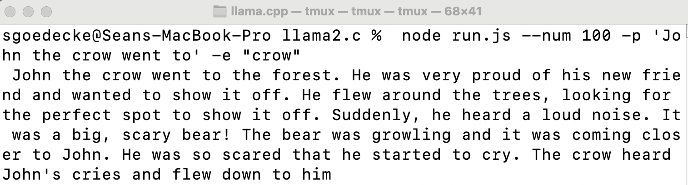

Over the last few weeks I've been playing around with the excellent [llama2.c](https://github.com/karpathy/llama2.c) repository, which is basically a simple one-file C implementation of the Transformer architecture that powers models like Meta's LLaMA and OpenAI's GPT models. I had a great time trying to [port](https://github.com/sgoedecke/llama2.js) llama2.c into a higher-level language (I tried Ruby and was ultimately successful with Javascript).

I ended up hacking a few interesting behaviours into the attention and token-generating mechanisms. This post will go through my experience, what I found difficult, what was surprisingly easy, and what I played around with once I had a working local implementation. I'll assume familiarity with how LLMs work (see my [post on that](/how-llms-work) if you want).

Overall I'd say the tokenizing was more straightforward than I thought it'd be, and decoding was _much_ more straightforward. I wasn't aware of the token scores and token merging algorithm, but it makes a lot of sense. Parsing the `.bin` model file was fine too. The hardest part was my choice to use actual multi-dimensional tensors for the weights, instead of copying the C implementation's use of regular 1-D arrays with offsets all over the place. I reviewed a couple of higher-level language ports for inspiration, but they all used offsets too, and I'd hacked most of it together before I noticed that the C++ [port](https://github.com/leloykun/llama2.cpp/blob/master/run.cpp) (of all things) used multi-dimensional tensors. Thanks to @leloykun, that really helped me pull it together.

My first few iterations of this generated repeated tokens (e.g. the prompt "Once" produced "Once cececececececece"). Debugging this was a _giant_ pain, and convinced me that big AI labs must have a bunch of internal model debugging tools (or there's something in PyTorch that I'm not aware of). Since I had a model C implementation at hand, I ended up dialing the temp down to 0 on both, using the same prompt, and stepping through the code in both programs to see where my program went wrong. Since this meant comparing very large arrays of 32-bit floats, my strategy was to print the first five floats of the array I wanted to compare and eyeball it. Eventually I graduated to a few larger randomly-chosen indexes, to give myself a better chance of catching problems in heads that weren't head 0 (since at least some of the logic only kicks in then.)

I had to fix two or three silly bugs (e.g. typing `xb2` instead of `xb`) before the model started generating plausible sentences. It still wasn't the same as the `llama2.c` output, though: after eight or so tokens it began to drift. Interestingly, the difference felt _meaningful_. The C implementation told a story that related to the prompt, while mine didn't: whatever the prompt was, it began telling a generic story that had no relation. I felt this had to be a problem with the attention mechanism, since it was generating a coherent output but wasn't paying attention to my prompt - and I was right! I was using an attention array that was far too small, only large enough to hold a single head's worth of attention:

```javascript
    att: new Float32Array(config.seqLen)
```

 I fixed that by changing it to:

 ```javascript
    att: new Float32Array(config.seqLen * config.nHeads)
```
 
Now it finally produced identical output to the C implementation.

Speaking of 32-bit floats, my first attempt was to write this in Ruby. I got much of the way there before realising that Ruby only supports 64-bit, which demoralized me enough to stop and choose JavaScript. I don't actually know if a 64-bit implementation could work, or if the slight differences in calculations would screw up the weights. My guess is it would work - if you can quantize down to 4-bit ints, surely you can go the other way - but it does make it harder to debug since you're not comparing exactly identical floats.

Once I had a working end-to-end implementation, I had two goals: to dig in and try and develop an intuitive understanding of transformers, and to play around and fiddle with some ideas I had. If you want to read my attempt at that first goal, see my [post on that](/how-llms-work). The first thing I wanted to fiddle around with was to try and visualize the current attention weights. There were two steps to this. First, since attention weights are separate per-head, I had to combine them into a single number after the token was generated:

```javascript
let mashedAtt = runState.att.subarray(0, config.seqLen)
for (let head = 1; head < config.nHeads; head++) {
    const att = runState.att.subarray(head * config.seqLen, (head + 1) * config.seqLen)
    for (let i = 0; i < att.length; i++) {
        mashedAtt[i] += att[i]
    }
}
```

Then I assigned `mashedAtt` to an object that held the token (which I called `piece`), and displayed it in the terminal like so:

```javascript
function printWithHighlightedAttention(output) {
    console.clear() // need to clear and rewrite each time because previous att changes

    buf = ''
    output.forEach((chunk, i) => {
        let colour
        const currentAttention = output[output.length - 1].att[i]
        if (currentAttention > 0.7) {
            colour = colours.bright
        } else if (currentAttention > 0.1) {
            colour = colours.reset
        } else {
            colour = colours.dim
        }
        buf += colour
        buf += chunk.piece
        buf += colours.reset
    })
    process.stdout.write(buf)
}
```

Note that each token changes the attention scores for each previous token. Being able to visualize this helps develop an intuition of what the attention logic is doing.



The token we've just generated is `He`. Note that the most relevant tokens here are the previous pronoun `He` and the name `John` - that's the model attempting to be consistent between names and pronouns. It's not relevant that he's a raven, or that he went to the park, or that he's excited. Continuing the story, take this later screenshot:



Now the token we've generated is `birds`. Note that `raven` is now highlighted - the fact that John is a raven is now something the model needs to generate the next token.

I won't share screenshots of this since it's common in other implementations, but it's equally trivial to visualize the confidence with which the model selects each token and highlight that:

```javascript
// calculate how much the top logits differ
const topLogits = Array.from(runState.logits).sort((a, b) => b - a).slice(0, 3)
const topLogitDiff = topLogits[0] - topLogits[2]
...
function printWithHighlightedConfidence(output) {
    const lastChunk = output[output.length - 1]
    let colour
    let buf = ''
    const diff = lastChunk.topLogitDiff
    if (diff > 6) {
        colour = colours.bright
    } else if (diff > 2) {
        colour = colours.reset
    } else {
        colour = colours.dim
    }
    buf += colour
    buf += lastChunk.piece
    buf += colours.reset
    process.stdout.write(buf)
}
```

One other thing I did that I thought was interesting is _update_ the attention mechanism in-flight. My idea was to accept both a prompt and an "emphasis" substring of the prompt, which my code would artifically inflate the attention values of. I know there's something similar in AI visual output prompting, but I hadn't seen anything like this in textual output, so I was excited to try it out.

The first step, which proved surprisingly tricky, was identifying the position of the emphasis substring in the prompt. Since prompts aren't tokenized by words, and are tokenized in a way that depends on token _score_, I couldn't simply tokenize the emphasis and expect it to be a sub-array of the prompt tokens. The emphasis word might be tokenized differently in the prompt itself. There's definitely more efficient ways of doing this, but I ended up iterating over the prompt tokens twice with a sliding head/tail:

```javascript
// calculate position of emphasized string
const emphasisPos = { left: 0, right: 0 }
for (let i = 0; i < promptTokens.length; i++) {
    const head = promptTokens.slice(i).map((token) => tokenizer.vocab[token]).join("")
    if (!head.includes(emphasis)) {
        emphasisPos.left = i -1
        break
    }
}
for (let i = promptTokens.length; i>0; i--) {
    const tail = promptTokens.slice(-i).map((token) => tokenizer.vocab[token]).join("")
    if (!tail.includes(emphasis)) {
        emphasisPos.right = promptTokens.length - i + 1
        break
    }
}
```

Then, inside the part of the forward-pass step that generated the attention scores, I added a magic emphasis factor:

```javascript
// juice the attention weights of any tokens in the emphasis segment
for (let j = 0; j <= att.length; j++) {              
    if ((j >= emphasisPos.left - 1) && (j < emphasisPos.right -1)) {
        // randomly-ish chosen emphasis factor. more seems to provide gibberish, less gets drowned out
        att[j] += 2.5; 
    }
}
```

Note that this is pre-softmax, so we still end up with a nice distribution in the attention tensor. I chose to add 2.5 by fiddling around a bit - any less and it was drowned out, any more and it broke the attention mechanism entirely. Let's see an example! Here's a generation with no emphasis:



Now let's emphasize the word "crow", in an attempt to get a more crow-focused story:



It worked! Now he's flying, he's in a more crow-appropriate scenario, and another crow shows up later on. Obviously this is an incredibly crude approach, but it's interesting that even in this form it works more or less as you'd expect it to. I suspect there's a lot of mileage to be had out of a more sophisticated attention-hacking mechanism in LLMs.

What haven't I done yet? One thing I want to do that I haven't done yet is to play around with parallelizing the model. Any performance lessons I learn aren't likely to be relevant to actual scale LLMS, since my toy model will be dominated by bottlenecks that aren't present in any productionized inference steps. Still, it'll tell me what can be parallelized and what can't. I know per-head attention can be trivially parallelized, and I want to try out the trick from this [@karpathy tweet](https://x.com/karpathy/status/1697318534555336961?s=46&t=IkBfJ4QW2Yh1eU-QP0dAQQ):

1. Take a slow model and a fast model
2. Generate a five-token sequence sequentially with the fast model
3. Take that five-token sequence and generate all those sub-sequences in parallel (e.g for abcd, generate a, b given a, c given ab, d given abc) with the slow model
4. If any of these slow model generations don't pick the fast model's token, throw it the fast model sequence away and keep generating slowly

The idea here is that (a) parallel token processing is surprisingly performant for large models, since the big performance hit is packing the transformer weights into memory, and (b) most token generation is obvious and can be done by smaller models, such as completing words/adding spaces after full stops/etc.

In general I strongly recommend porting llama2.c yourself and fidding around. It's been a huge learning experience for me.
