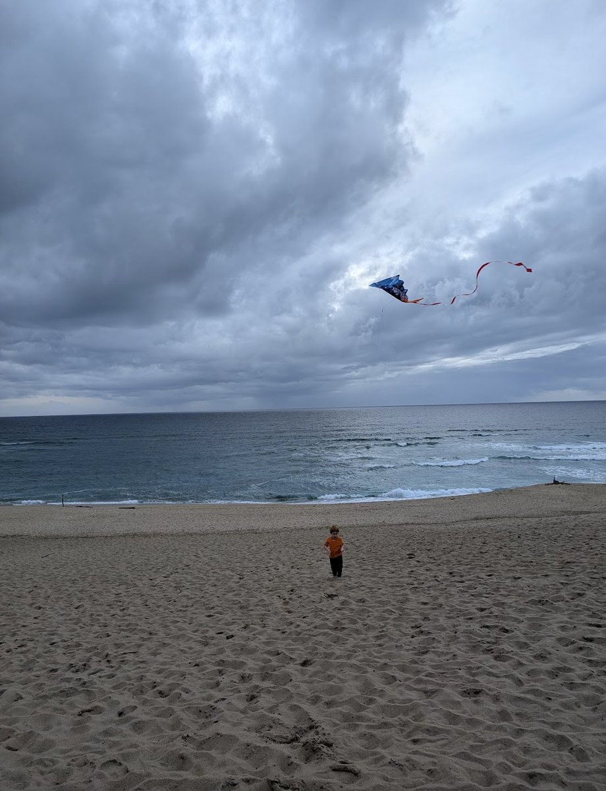

In April last year, Kelsey Piper [discovered](https://x.com/KelseyTuoc/status/1917340813715202540) that OpenAI's o3 model was surprisingly good at figuring out where a photo was taken from. Like human "geoguessr" [pros](https://www.youtube.com/@georainbolt), o3 could sometimes take a nondescript photo of a beach and tell you exactly where it is. Here's the example Kelsey gave:

Several people [reproduced this](https://www.astralcodexten.com/p/testing-ais-geoguessr-genius) with good results: not a 100% success rate, but clearly _far_ better than you'd do with a random human guess. The lesson here is that **model capabilities can surprise us**. The o3 model had been released for two weeks before Kelsey's tweet without anyone noticing how good it was at geolocation. What obscure capabilities did we never find? What capabilities of current models are we missing today?

Some people drew [another](https://newsletter.angularventures.com/p/ai-s-geoguessr-genius-and-the-art-of-prompting-well) [lesson](https://www.reddit.com/r/singularity/comments/1kep2bp/comment/mqlvv1a/) from this: that "prompt engineering" can unlock brand-new capabilities. This is because Kelsey had a [magic prompt](https://raw.githubusercontent.com/sgoedecke/ai_geolocation/refs/heads/main/prompts/geoguessr_protocol.txt) that she built over time. When o3 got something wrong, she would ask it how it could have avoided the mistake, and then included that in the prompt. Here's the first 10% of that prompt, so you get the idea:

> You are playing a one-round game of GeoGuessr. Your task: from a single still image, infer the most likely real-world location. Note that unlike in the GeoGuessr game, there is no guarantee that these images are taken somewhere Google's Streetview car can reach: they are user submissions to test your image-finding savvy. Private land, someone's backyard, or an offroad adventure are all real possibilities (though many images are findable on streetview). Be aware of your own strengths and weaknesses: following this protocol, you usually nail the continent and country...

This prompt impressed a lot of people, who [tried](https://www.reddit.com/r/singularity/comments/1kep2bp/comment/mqo3yzz/) [it](https://www.thealgorithmicbridge.com/p/upload-a-picture-to-chatgpt-itll) [out](https://www.astralcodexten.com/p/testing-ais-geoguessr-genius) and reported that it correctly identified a lot of images. But of course, o3 correctly identified a lot of images with just a basic "think carefully about where this picture was taken?" prompt. Did the prompt actually help? It'd be tough to figure that out just from playing around in ChatGPT. You'd need to build an evaluation set of images and run o3 against them twice: once with the fancy prompt and once without it.

So [that's what I did](https://github.com/sgoedecke/ai_geolocation/tree/main). I pulled 200 images from Wikimedia Commons, Geograph Britain and Ireland, and iNaturalist for the benchmark. You can read the AI-generated summary [here](https://github.com/sgoedecke/ai_geolocation/blob/main/results/dataset_mixed_200_o3_high_report.md), but here's the key table:

| Prompt | n | Median km | Mean km | P25 km | P75 km | <=25 km | <=100 km | <=500 km | <=1000 km |
|---|---:|---:|---:|---:|---:|---:|---:|---:|---:|
| Default | 200 | **83.2** | **440.7** | **16.4** | **221.9** | 58 | **109** | **176** | **182** |
| GeoGuessr prompt | 200 | 102.3 | 481.9 | 18.5 | 277.8 | **59** | 99 | 172 | 180 |

In general, the basic prompt did better on average. It consistently guessed closer to the actual location. Both prompts did pretty well, actually. Despite the fancy prompt being 10x larger, it only caused o3 to think for slightly longer (about one second on average, though the max was about double, at 10 minutes instead of 5 minutes). The images in my benchmark were fairly generic geoguessr-style outdoor images, with twelve indoor images thrown in for an extra challenge (the fancy prompt also did slightly worse on these).

What's going on? I think this shows **how easy it is to fool yourself about the quality of prompting**. When the model is already pretty good at a task, you can give it a very elaborate prompt without impacting performance. It'll still be pretty good, except this time it's good _because of what you did_. This is particularly true if you're iterating with the model and asking it "what should I add to the prompt" for each mistake. Models will happily make up stories for you about their own reasoning processes, and will almost always say "yes, that helped a lot!" when you ask them if a particular prompt tweak made things better. The only way to actually know is by constructing some kind of benchmark[^1].

It's also interesting to me that nobody checked this at the time. It took me about six hours of fairly-distracted work and about $15 to construct and run this benchmark. Why didn't anyone do this when they were writing articles about how good the o3 prompt was?

One charitable reason might be that the story was more about o3's real geolocation ability than about the magic prompt. The pricing for o3 also used to be about five times more expensive (though a benchmark of 40 images instead of 200 would still have thrown doubt on how much water the prompt was carrying). Also, AI just moves so _fast_. Geolocation was only the story for about a week: after that, GPT-4o's [sycophancy](/ai-sycophancy) was what people were talking about. Another reason is that AI tooling wasn't as good then. The benchmark was so easy for me to run because GPT-5.5 did most of the heavy lifting. Prior to strong agents, you would have had to write the (simple) benchmark yourself. I can't point the finger too hard: I didn't bother at the time either.

Maybe my benchmark isn't very good? The photos look reasonable enough: a wide variety of geoguessr-like shots of roads and landscapes, mostly. I could have tried to gather a few thousand photos instead of a few hundred, but if the magic prompt really was a big improvement you'd still expect to see that manifest on a benchmark this size. If someone wants to go and build a hundred-dollar geolocation benchmark instead of my fifteen-dollar one, I think that'd be an interesting project.

Finally, let's use the benchmark to answer a question I've had for a while: do gpt-5.4 and gpt-5.5 have o3's geolocation abilities? The answer, apparently, is no.

| Run | Median km | Mean km | <=25 km | <=100 km | <=500 km |
|---|---:|---:|---:|---:|---:|
| **o3 default** | **83.2** | **440.7** | 58 | **109** | **176** |
| o3 GeoGuessr | 102.3 | 481.9 | **59** | 99 | 172 |
| gpt-5.4 default | 163.3 | 638.9 | 26 | 74 | 148 |
| gpt-5.5 default | 156.5 | 645.9 | 39 | 77 | 161 |

Whatever o3 had that made it good at this task hasn't transferred to newer models. 

[^1]: Benchmarks can mislead as well, but they're better than just vibes.