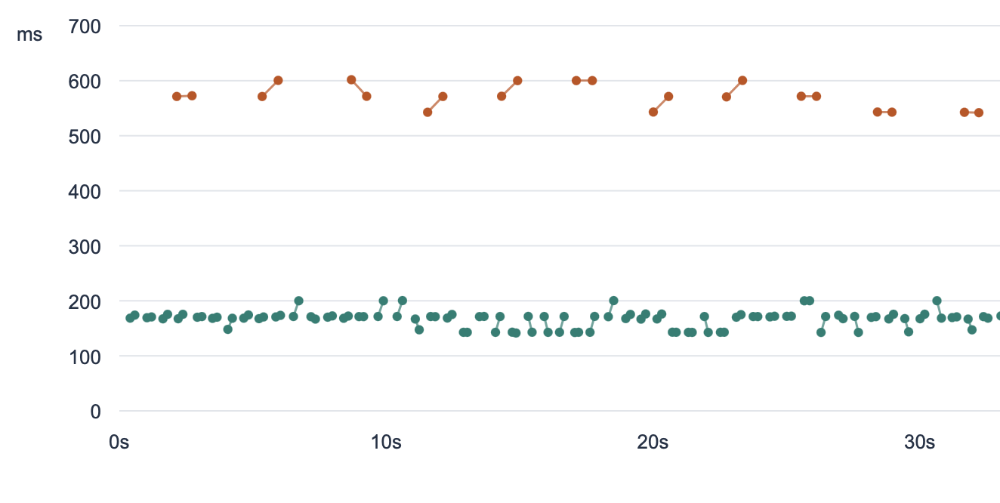

I recently wrote about [Jev](/jev-means-structured-output-is-interesting-again/), a new "System One" language model that only outputs _decisions_: the answers to a set of user-provided multiple-choice questions. This means it's nowhere near as flexible[^1] as a traditional LLM like ChatGPT, but in return it's consistently fast.

We don't know exactly how Jev works. I've seen people say diffusion, or various tweaks to the Transformer architecture, or some entirely new type of model. But that doesn't matter. Like I argued [here](/jev-means-structured-output-is-interesting-again/#structured-output-can-already-be-fast), it isn't hard to turn any LLM into a System One model. By batching prompts that generate a single token with structured output, you get a consistently fast general-purpose classifier. I vibed up a basic version to play with [here](https://github.com/sgoedecke/system-one/tree/main) in ~150 lines of Python (most of which is error handling).

Note that _this doesn't require changing the model_. As long as you have access to the logits (for structured outputs) and can prefill data into the prompt, you can turn any LLM into a general fast classifier. What's it like to program with one of these? While wiring up the demos for my library, I learned two techniques that I want to write about: setting tiered goals and tournament choice sampling.

### Doom

Here's Qwen3-8B playing Doom:

<video controls playsinline preload="metadata" style="width: 100%;">
  <source src="./doom-qwen3-8b.mp4" type="video/mp4">
</video>

If you compare this to the [video](https://github.com/sgoedecke/system-one/blob/main/docs/demos/doom-qwen3-8b-tool-agent.mp4) of the same model playing Doom with regular tool calls, it's clear that the System One version of the model is doing more things and reacting more quickly. The tool-calling model makes one decision every 600ms or so, while the System One model makes six or seven batched decisions every 190ms[^2]:

Both Qwen3-8B and Jev are text-only models, so both demos require a step where we translate the game state into text. However, it'd be trivial to support image (or audio) input by choosing a multimodal LLM.

### Goals and sub-goals

What's interesting about implementing the Doom demo is that **just supplying the game inputs as choices doesn't work very well**. A single forward pass - 200ms - is enough time to react to the current game state, but doesn't bring enough compute to bear to derive the current short-term goal (e.g. "kill this enemy", "collect this item") and choose to follow it. When I wired it up that way, the model held down the "shoot" button 100% of the time (why not, I guess) and just aimlessly wandered around the level. 

The fix is to periodically ask the model to choose between a fixed set of short term goals (e.g. "collect armor", "kill enemies") and then include that goal in the regular every-200ms prompt. If you look at the Doom video in the Jev demo, you can see that they're doing exactly that. As soon as I did it as well, my model started playing in a more human-like way.

This is an interesting technique for working with System One models. In a way, it's the equivalent of regular LLM reasoning, since it provides a way to use more compute on the same problem. I can imagine a real-time system that manages several layers of goals in this way:

1. An every-ten-second loop that sets an overall strategic goal
2. An every-five-second loop that sets a tactical subgoal based on (1)
3. An every-second loop that breaks down the current tactical subgoal into specific targets
4. A tight inner loop that runs as fast as possible (e.g. every 100ms) that controls which actual inputs are activated

The general structure here should be pretty familiar to anyone who's worked in game or robotics AI. In theory you could replace (1) with an actual LLM, and have that generate the lists of options for steps (2) and (3). In practice I suspect this will be tricky to get right, and it'll be better to just write down a list of all possible goals ahead of time. This would work just fine for game-playing and well-understood tasks.

### Wikiracing

I also reimplemented the Wikiracing demo from the Jev [launch post](https://typesafe.ai/blog/introducing-system-one-models-and-jev), where the model has to start at the Wikipedia page for "baseball" and navigate as quickly as possible to the Wikipedia page for "sun". You can watch the video for that [here](https://github.com/sgoedecke/system-one#wikipedia-race), though it's less impressive than the Doom demo. 

The difficulty with the Doom demo is getting the model to loop quickly enough and to commit to short-term plans. For Wikiracing, the difficulty is _scale_: the Wikipedia page for "baseball" has over a thousand internal links. Jev only supports 255 choices for a single question, and my hacked-together System One layer was similar. While it technically would scale out to more choices, it stopped working well[^3] after a hundred or so.

Jev's approach here is to do "a 2 stage-system of scoring independently then making an explicit choice". This did not work very well for me at all. I think here Jev is benefiting from the fact that it's specifically trained to give confidence estimates. Qwen3-8B gave a few hundred of the links the same top score, which wasn't helpful. It ended up taking multiple minutes to find a thirty-or-forty link path between the two pages.

What I tried instead was **tournament sampling**: I fed a hundred links at a time into each choice, then did a second pass with the chosen links. This worked _great_. The model found the ideal three-link path (if you're curious, "baseball"/"scientific american"/"amateur astronomy"/"sun"). I recommend this pattern if you're trying to find the best option among many choices. Ordinary LLMs are way better at relative judgements than absolute ratings.

### Conclusion

I remain optimistic about the potential of System One models - fast general classifiers - to build AI systems that aren't just chatbots. It feels like this is a meaningful alternative to tool calls for realtime scenarios or use-cases where you need predictable inference timing. Just as generic LLMs often outperform domain-specific models, I think it's likely that generic System One models will sometimes outperform domain-specific classifiers (though they will always be larger and slower).

I do think the big labs are definitely going to try and compete by releasing a choice-only version of their small, fast models. If Jev gets any traction, we will soon see a System One Terra and a System One Haiku, and we will certainly see "real" versions of my vibed up System One [library](https://github.com/sgoedecke/system-one). We should start working out the best way to write programs with these models now.

[^1]: Technically you can give it the multiple-choice question of "which letter comes next" to make it act like a normal autoregressive LLM, but that wouldn't really work. 
You can think of System One models as general-purpose classifiers. Instead of having to train a new classifier per-task, you can use a System One model. It'll be bigger and slower than a custom classifier model, but far more flexible, and you can tweak it via adjusting the prompt instead of having to re-train the model.

[^2]: I started on a 4090, which was able to make decisions every 500ms, but that wasn't really quick enough for Doom. I could probably have optimized it further but instead I just rented an H100 for ten minutes to record the demo, which got it down to a 190ms loop. I recorded the tool-calling Doom demo on the H100 too, so it's a fair comparison.

[^3]: There's an interesting research question here about how to implement choices like this, since they have to be predictable by a single token. I started with indexes but found "labels" (just picking some token to associate with the choice) performed _way_ better on Wikiracing (though not Doom). How many choices do you have to have before labels are better than indexes? Of course, you could alter the model to directly output the choice, but I like the idea that you can do all of this in the inference code for any LLM.