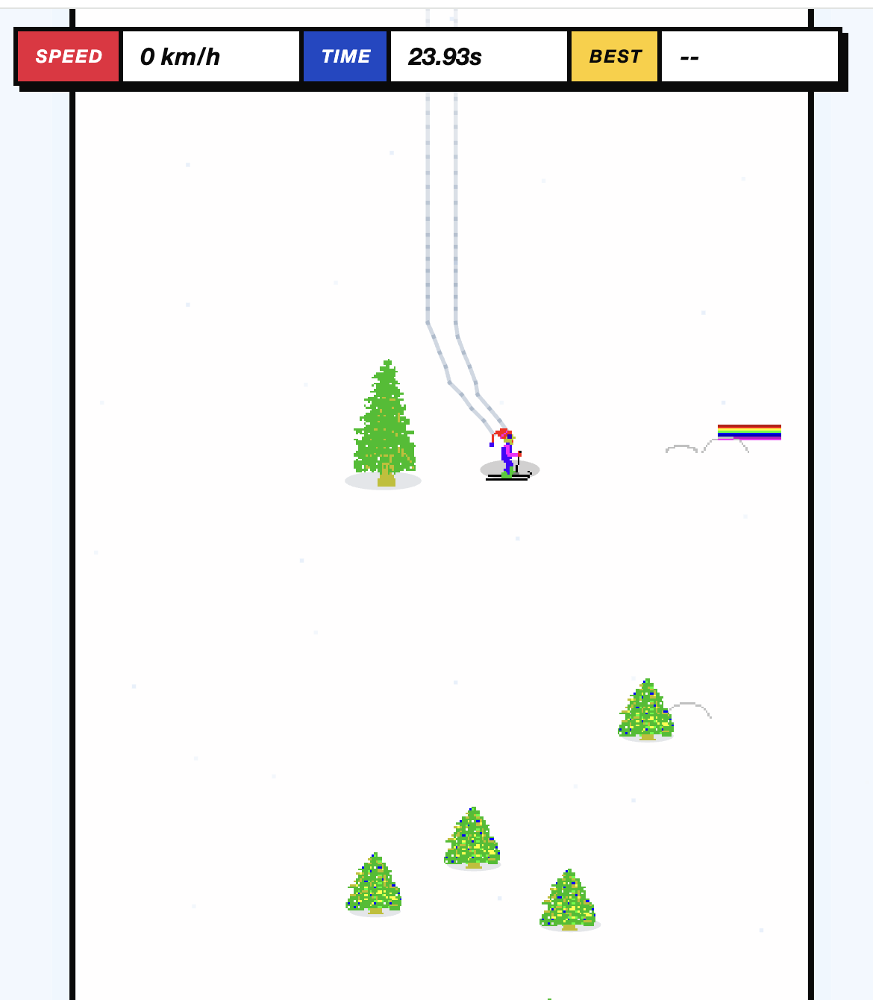
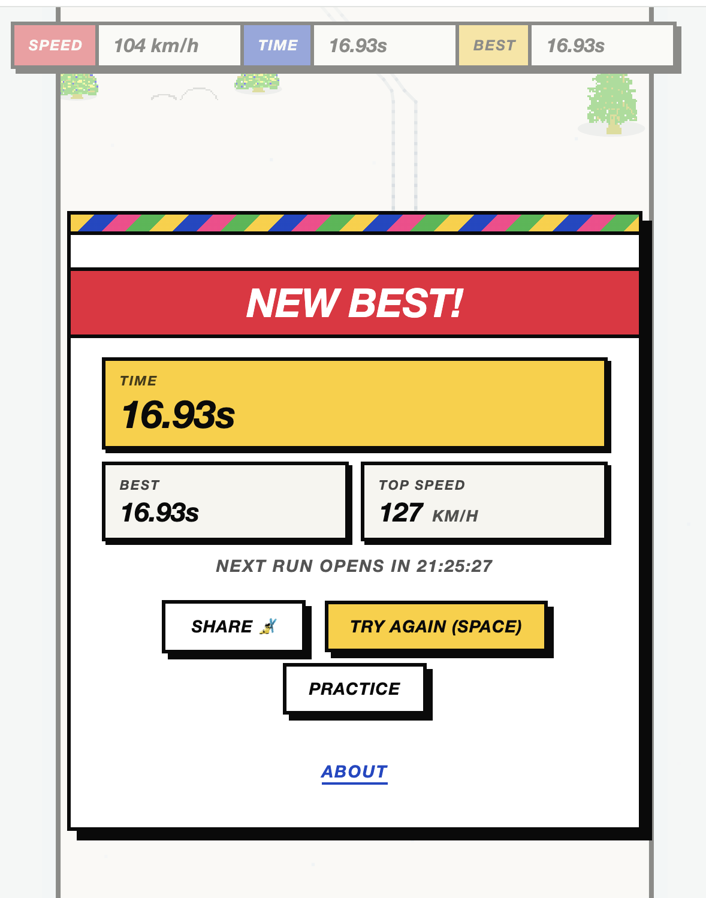
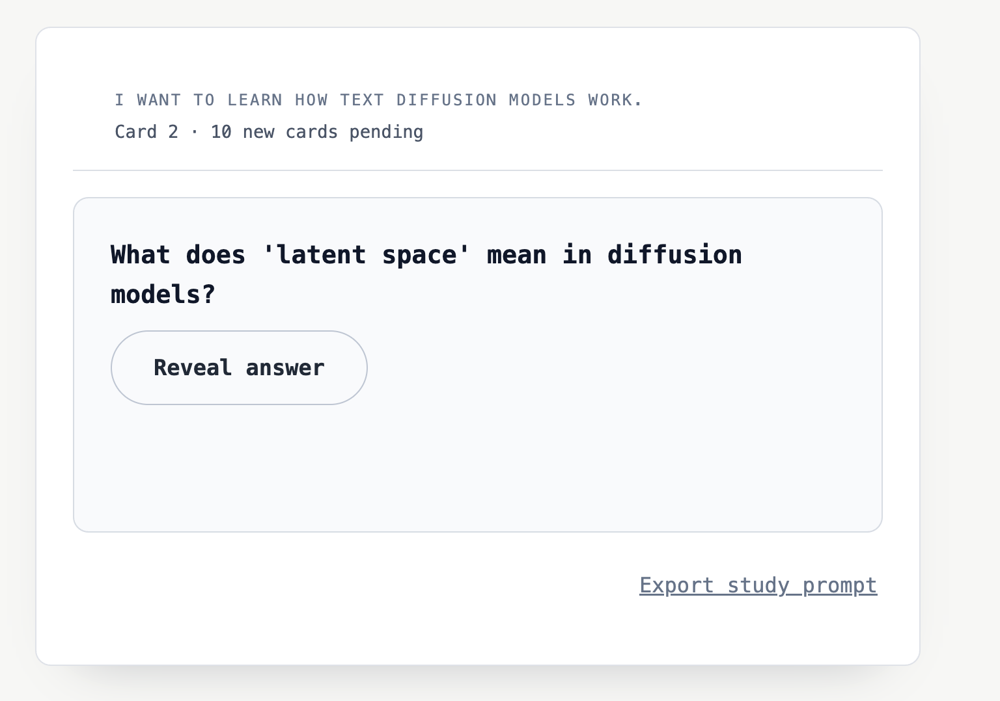
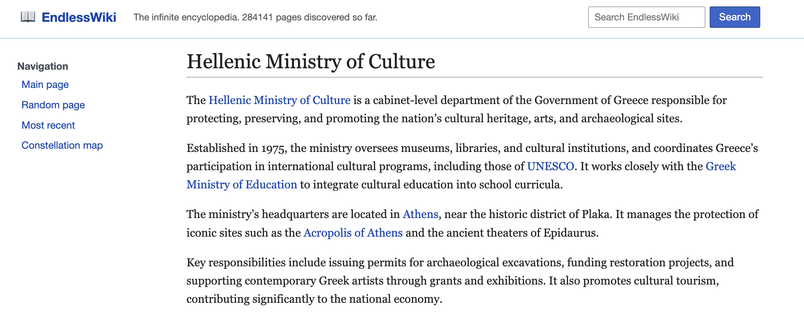

Where are all the AI-generated projects? This is a [common question](https://news.ycombinator.com/item?id=46262545) from AI skeptics: if LLMs are so good at writing code, where is the tsunami of new AI-generated apps, services and games?

I personally don't find this to be much of a paradox. Writing code is only one of the bottlenecks involved in actually [shipping](/how-to-ship) a new product, after all. It's also impossible to talk about the paid work I've done with AI (you'll simply have to take my word that it's increased my productivity). But one thing I can do is share a list of personal projects I've built with AI in the last twelve months.

I definitely would not have done _all_ of these by hand. I might have found the time to do one or two of them, but based on my pre-AI track record they would probably have stayed in the "GitHub repo with a few commits" stage. This list is a kind of [existence proof](https://sites.millersville.edu/bikenaga/math-proof/existence-proofs/existence-proofs.html): a bunch of weird projects, useful to at least some people, that would not have existed without AI assistance[^0].

### Skifreedle

Most recently I've built [skifreedle.com](https://skifreedle.com/), a daily-game version of the classic Windows SkiFree [game](http://ski.ihoc.net/) (i.e. "like Wordle, but for SkiFree"). The code for that is [here](https://github.com/sgoedecke/skifreedle)[^1]. 

I enjoy coding small web games by hand, but _definitely_ would not have had the time to wire up all the different SkiFree objects or build neat features like a ghost of your fastest run. I also tried out a lot of different visual themes for the game UI before landing on something I liked. If I'd done this by hand, I would have only had time to try out two or three different looks, instead of fifteen or twenty.

I'm very happy with how this turned out. I've been enjoying competing against my brother to get better times, since both of us have a lot of nostalgia for the original SkiFree game.

### Autodeck

Last year I built [Autodeck](https://www.autodeck.pro/)! I wrote a [blog post](/autodeck/) about this before, but this came from my partner wishing there was some way to automatically generate Anki cards about random topics she wanted to learn about. It ended up being relatively straightforward to set up an endless feed of auto-generated spaced repetition cards:

I set up Stripe payments for this one, more because I was worried about someone running away with my Groq balance than because I wanted to make money, but I was pleasantly surprised to see a bunch of people actually use this. Over five hundred people have tried it out, with enough paid subscribers to cover inference and hosting.

I _might_ have built this without LLM assistance, but I almost certainly would not have _deployed_ it as a website. The hassle of setting up a database and Stripe would have just been too much work.

### Endless Wiki

I also built an AI-generated [endless wiki](https://www.endlesswiki.com/). I wrote a [blog post](https://www.seangoedecke.com/endless-wiki/) about this one as well. Like Autodeck, I was fascinated with the idea of non-chat interfaces for LLMs, and I thought a wiki-based approach where you interact with the model by clicking links was pretty cool.

I learned the hard way that putting a LLM generation call on the end of a regular link was a bad idea: scrapers would exhaust my inference budget quickly. I ended up faking the no-article-exists-yet links with JavaScript, which at least so far has defeated scrapers. People still email me about Endless Wiki, and there are over 280 thousand pages generated.

My original goal was to see if you could eventually generate a page for Neon Genesis Evangelion, starting at the root page and only following links (kind of like [wiki golf](https://dev.to/zmbailey/wikigolf-an-automated-traversal-of-wikipedia-9o0)). I was successful! You can read the "Evangelion Anime" page [here](https://www.endlesswiki.com/wiki/evangelion_anime).

Almost exactly a month after I launched Endless Wiki, xAI launched [Grokipedia](https://en.wikipedia.org/wiki/Grokipedia). Obviously they didn't plagiarize me. This is a very easy idea to have, and my site was not the first infinite wiki (though I think it was the first one where you had to discover new pages by clicking on links). But it did take some of the shine off.

### VicFlora Offline

I built a [PWA](https://vicfloraoffline.netlify.app/) that caches the VicFlora plant identification database so it could be used with low or no internet. This was more of a utility project for my partner, who likes plants and occasionally goes on field trips where internet is spotty.

I would definitely not have done this without LLMs. It was reasonably difficult to scrape the basic dichotomous key from the VicFlora website: their API documentation was out of date, there were multiple possible pathways for fetching data (most of which were not functional), and the format of the data I did manage to fetch was hard to parse. I think I _could_ have done it, with enough effort, but it would have been a substantial amount of work.

I'm very happy with how this turned out. It's not perfect, but it's functional, and I've even had the occasional Victorian botanist email me with bug reports or feature requests, so it's clearly seeing a little bit of usage.

### Other projects

I did a bunch of other stuff that doesn't necessarily rise to the level of a "deployed project": my [gh-standup](https://github.com/sgoedecke/gh-standup) GitHub CLI extension to automatically generate a standup report, which has just over a hundred stars, my (low quality) image geolocation [benchmark](https://github.com/sgoedecke/ai_geolocation), which I blogged about [here](/the-o3-geoguessr-prompt-did-not-work/), or my [skill](https://github.com/sgoedecke/skills/blob/main/skills/extract-features-clamp-inference/SKILL.md) for extracting features from open-source models.

There may not be a flood of AI-generated companies (yet), but at least for me there's been a flood of small, weird projects that would not have existed without significant LLM assistance.

[^0]: I also want to shout out Simon Willison's [version of this](https://simonwillison.net/2025/Sep/4/highlighted-tools/), which is another great example of "weird useful tools that only exist because the cost of creating them was so low".

[^1]: I did lift the spritesheet from DanielHough's [SkiFree.js](https://github.com/basicallydan/skifree.js), which attributes it to [Wing Wang Wao](http://spriters-resource.com/submitter/Wing%20Wang%20Wao). Of course, the original sprites and art belong to Chris Pirih's SkiFree and Microsoft.
