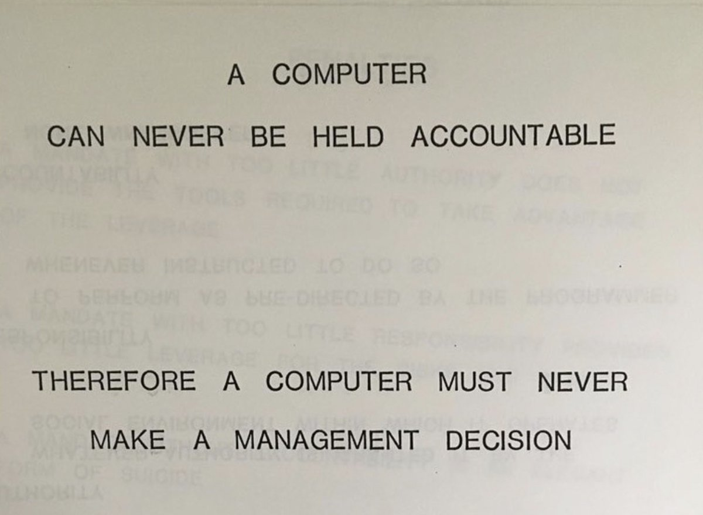

It's a strange time to be a software engineer. Large language models are very good at writing code and rapidly getting better. Multiple multi-billion dollar attempts are currently being made to develop a pure-AI software engineer. The rough strategy - put a reasoning model in a loop with tools - is well-known and (in my view) seems likely to work. What should we software engineers do to prepare for what's coming down the line?

## In the short term, learn AI and get promoted

There are some obvious short-term answers:

- Get what [advantage](/how-i-use-llms) you can out of AI tooling
- Understand the [technical](/how-llms-work) [principles](/mcts-and-llms) behind language models, so you can participate in the growing quantity of AI work
- Acquire [status](/how-to-ship), since it certainly seems like more junior roles will be replaced first

Nobody really knows how long the short-term will be. I can't see AI software engineers replacing large quantities of jobs in the next five years - big enterprises just don't move that fast. A large company will have to take a risk on this new technology, and others will follow after a few years pass and no disaster happens. It could be longer than that if the technical problem is harder than it looks or AI progress stalls out.

## In the medium term, lean into legacy code

What about the medium term? What software engineering skills are LLMs likely to develop last? One way to answer that question is to think about what skills they're likely to develop _first_. Right now the most impressive coding feat LLMs can produce is exceptional performance in competitive programming. The distinguishing characteristics of that work are:

- It's technically difficult (to some extent, mathematically difficult)
- Problems are well-defined, well-scoped
- Solutions are trivially verifiable
- The total volume of code involved is very low

So what kind of programming work would be the opposite of this?

- Problems are ill-defined and poorly-scoped
- Solutions are difficult to verify
- The total volume of code involved is massive

In my view, this is describing _legacy code_: feature work in large established codebases. Translating requirements into the needed change in these codebases is hard. It's even harder to be confident that you haven't introduced another bug, given the [combinatorial explosion of feature interactions](/large-established-codebases). And the amount of code you have to read and write is massive: millions or tens of millions of lines.

I think LLMs will eventually be able to do this kind of work. But it's going to be a while, for a few reasons. First, it requires a better solution to the large-context problem: either significantly better RAG, or a fast and effective way to have a multi-million-token context window. If we're very lucky, this problem will turn out to be impossible. Second, it's hard to write a really good eval for legacy code adjustments. Current software engineering evals are relatively small in scope. Third, the relevant data is spread over a lot of very private silos. Facebook or Google can train on their own internal PRs or change requests, but no single AI lab is likely to have access to multiple companies' codebases and stack of PRs/JIRAs.

So if you're currently very strong at LeetCode and well-defined, hard technical problems, consider spending more time on the monolith codebase at your company. Engineers who can do that kind of work well may get an extra five or ten years of a career out of it.

## In the long term, take responsibility

There's a famous IBM slide from 1979 that reads "A COMPUTER CAN NEVER BE HELD ACCOUNTABLE / THEREFORE A COMPUTER MUST NEVER MAKE A MANAGEMENT DECISION".

The key idea here is that management is not just about making good decisions. It's about being accountable for the decisions you make, good or bad. This is also true about engineering - more true the more senior you get, in my experience. An engineer is not just someone who writes good code. They're somebody who can be _trusted_: specifically, someone who non-technical executives can trust to answer technical questions and deliver technical projects.

Not all engineers are like this. Some engineers see their role as turning JIRA tickets into working code, or delivering features to customers that customers like. In my view, a plausibly strong LLM (2x or 3x current capability) can do these tasks. But a LLM strong enough to take responsibility - that is, to make commitments and be trusted by management - would have to be much, much more powerful than a strong engineer.

Why? Because a LLM has no skin in the game, which means the normal mechanisms of trust can't apply. Executives trust engineers because they know those engineers will experience unpleasant consequences if they get it wrong. Because the engineer is putting something on the line (e.g. their next bonus, or promotion, or in the extreme case being fired), the executive can believe in the strength of their commitment. A LLM has nothing to put on the line, so trust has to be built purely on their track record, which is harder and takes more time.

In the long run, when almost every engineer has been replaced by LLMs, all companies will still have at least one engineer around to babysit the LLMs and to launder their promises and plans into human-legible commitments. Perhaps that engineer will eventually be replaced, if the LLMs are good enough. But they'll be the last to go.