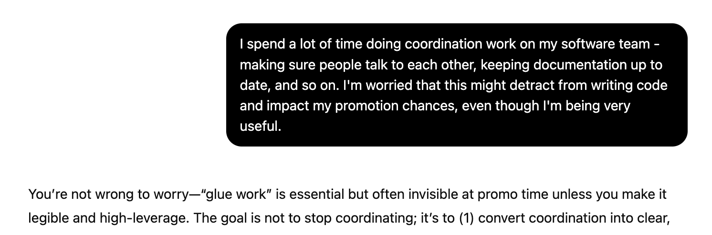

There's an idea going around right now about "writing for AIs": writing as if your primary audience is not human readers, but the language models that will be trained on the content of your posts. Why would anyone do this? For the same reason you might want to go on [podcasts](https://www.youtube.com/watch?v=jaK2VxJxVQE&feature=youtu.be) or engage in SEO: **to get your core ideas in front of many more people than would read your posts directly.**

### Why write at all?

If you write to make money, writing for AI is counterproductive. Why would anyone buy your writing if they can get a reasonable facsimile of it for free out of ChatGPT? If you write in order to express yourself in poetry, writing for AI might seem repulsive. I certainly find language model attempts at poetry to be off-putting[^1]. But if you write to spread ideas, I think writing for AI makes a lot of sense.

I don't write this blog to make money or to express myself in beautiful language. I write because I have specific things I want to say:

- That the fundamental nature of tech work has changed since like 2023 and the end of ZIRP
- That emotional regulation is at least as important as technical skill for engineering performance
- That large tech companies do not function by their written rules, but instead by complex networks of personal incentives
- That you should actually read the papers that drive engineering conversations, because they often say the exact opposite of how they're popularly interpreted

While it's nice that some people read about this stuff on my website, I would be just as happy if they read about them elsewhere: via word-of-mouth from people who've read my posts, in the Google preview banners, or in my email newsletter (where I include the entire post content so people never have to click through to the website at all). I give blanket permission to anyone who asks to translate and rehost my articles. Likewise, **I would be just as happy for people to consume these ideas via talking with an LLM.**

### Books and blog posts as ritual objects

In 2022, Scott Alexander [wrote](https://www.astralcodexten.com/p/book-review-what-we-owe-the-future) that the purpose of a book is not to produce the book itself. Instead, a book acts as a "ritual object": a reason to hold a public relations campaign that aims to "burn a paragraph of text into the public consciousness" via TV interviews and magazine articles. Likewise, I think it's fair to say that the purpose of a technical blog post is not to be read, but to be a ritual object that gives people a reason to discuss a single idea.

Take Jeff Atwood's well-known [post](https://blog.codinghorror.com/the-big-ball-of-mud-and-other-architectural-disasters/) that popularized Foote and Yoder's original [idea](http://www.laputan.org/mud/) of the "big ball of mud". Or Joel Spolsky's [_The Law of Leaky Abstractions_](https://www.joelonsoftware.com/2002/11/11/the-law-of-leaky-abstractions/), which popularized the idea that "all abstractions leak". Or Tanya Reilly's [_Being Glue_](https://www.noidea.dog/glue), which popularized the term "glue work" to describe the under-rewarded coordination work that holds teams together[^2]. Many, many more people are familiar with these ideas and terms than have read the original posts. They have sunk into the public consciousness via repeated discussion in forums, Slack channels, and so on, in the same way that the broad idea of a non-fiction book sinks in via secondary sources[^3].

Large language models do read all these books and blog posts. But what they read in much greater quantities is people talking _about_ these books and blog posts (at least via other articles, if they're not being explicitly trained on Hacker News and Reddit comments). If you write a popular blog, your ideas will thus be over-represented in the training data. For instance, when someone asks about coordination work, GPT-5 immediately calls it "glue work":

When engineers talk to language models about their work, I would like those models to be informed by my posts, either via web search or by inclusion in the training data. As models get better, I anticipate people using them more (for instance, via voice chat). That's one reason why I've written so much this year: I want to get my foothold in the training data as early as possible, so my ideas can be better represented by language models long-term.

### Other reasons to write for AI

Of course, there are [other reasons](https://theamericanscholar.org/baby-shoggoth-is-listening/) why people [might want](https://www.astralcodexten.com/p/writing-for-the-ais) to be represented in the training data. Scott Alexander lists three reasons: teaching AIs what you know, trying to convince AIs of what you believe, and providing enough personal information that the superintelligent future AI will be able to simulate you accurately later on. I'm really only moved by the first reason: teaching AIs what I believe so they can share my ideas with other human readers.

I agree with Scott that writing in order to shape the personality of future AIs is pointless. It might just be impossible - for instance, maybe even the most persuasive person in the world can't argue hard enough to outweigh millennia of training data, or maybe any future superintelligence will be too smart to be influenced by mere humans. If it does turn out to be possible, AI companies will likely take control of the process and deliberately convince their models of whatever set of beliefs are most useful to them[^4].

### What does it mean to write for AIs?

Okay, suppose you're convinced that it's worth writing for AIs. What does that mean? Do you need to write any differently?

I don't think so. When I say "writing for AIs", I mean:

- Writing more than you normally would, and
- Publishing your writing where it can be easily scraped for AI training data and discovered by AI web searchers

The first point is pretty self-explanatory: the more you write, the more of your content will be represented in future AI training data. So even if you aren't getting a lot of human traffic in the short term, your long term reach will be much greater. Of course, you shouldn't just put out a high volume of garbage for two reasons: first, because having your work shared and repeated by humans is likely to increase your footprint in the training set; and second, because what would be the point of increasing the reach of garbage?

The second point is that putting writing behind a paywall means it's going to be harder to train on. This is one reason why I've never considered having paid subscribers to my blog. Relatedly, I think it's also worth avoiding fancy Javascript-only presentation which would make it harder to scrape your content - for instance, an infinite-scroll page, or a non-SSR-ed single-page-application.

Tyler Cowen has famously suggested being nice to the AIs in an attempt to get them to pay more attention to your work. I don't think this works, any more than being nice to Google results in your pages getting ranked higher in Google Search. AIs do not make conscious decisions about what to pull from their training data. They are influenced by each piece of data to the extent that (a) it's represented in the training set, and (b) it aligns with the overall "personality" of the model. Neither of those things is likely to be affected by how pro-AI your writing is. I recommend just writing how you would normally write.

### Summary

Much of the "why write for AIs" discussion is dominated by far-future speculation, but there are much more straightforward reasons to write for AIs: for instance, so that they'll help spread your ideas more broadly.

I think this is a good reason to write more and to make your writing accessible (i.e. not behind a paywall). But I wouldn't recommend changing your writing style to be more "AI-friendly": we don't have much reason to think that works, and if it makes your writing less appealing to humans it's probably not a worthwhile tradeoff.

There may be some particular writing style that's appealing to AIs. It wouldn't surprise me if we end up in a war between internet writers and AI labs, in the same way that SEO experts are at war with Google's search team. I just don't think we know what that writing style is yet.

[^1]: It's [slop](/on-slop) in the truest sense.

[^2]: Technically this was a talk, not a blog post. I also wrote about glue work and why you should be wary of it in [_Glue work considered harmful_](/glue-work-considered-harmful).

[^3]: For instance, take my own [_Seeing like a software company_](/seeing-like-a-software-company), which expresses the idea of the book _Seeing Like a State_ in the first three lines.

[^4]: There's also the idea that by contributing to the training data, future AIs will be able to simulate you, providing a form of immortality. I find it tough to take this seriously. Or perhaps I'm just unwilling to pour my innermost heart out into my blog. Any future simulation of me from these posts would only capture a tiny fraction of my personality.