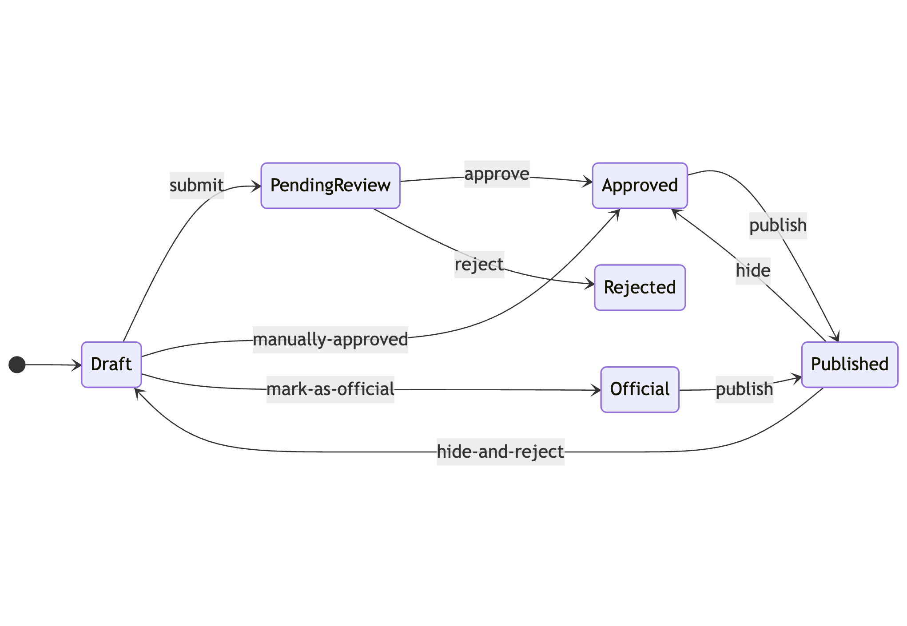

A popular principle for good software design is to **make invalid states unrepresentable**. In practice, this usually means doing two things:

1. Enforcing a single source of truth in your database schema. If users and profiles are associated with a `user_id` on the `profiles` table, don't also put a `profile_id` on the `users` table, because then you could have a mismatch.
2. Enforcing stricter types. If you use an "published/pending" enum to track comment status instead of a string field, you don't have to worry about weird strings you don't expect.

I think this is overall good advice. But it's possible to take it too far. In fact, **good software design should allow the system to represent some invalid states**.

### State machines should allow arbitrary state transitions

For instance, it's popular advice to represent many complex software processes as a "state machine". Instead of writing ad-hoc code, you can label the various states the system can be in and define a graph of which states can transition to which other states. The edges of that graph become your system's _actions_.

Here's an example. If you run an app marketplace, you might thus define a set of states like "draft", "pending review", "approved", and "published". The actions that connect those states might be "submit", "approve", "reject", "publish" and "hide".

Note that you can only submit a draft app, you can only reject a pending app, you can only hide a published app, and so on. These constraints are the entire point of using a state machine. It's the constraints that make the system much easier to reason about: instead of a ton of app state that could all be modified independently, you have four possible states and five possible actions.

The problem, of course, is in the edge cases. What happens when you need to account for "official" apps, which are developed internally and shouldn't go through the normal review process? What happens when a key partner's app is mistakenly rejected, and the engineering team is asked to "un-reject" it without forcing the partner to resubmit?  What happens when a published app has to be hidden in a way that prevents it from being published again?

There are two ways to handle edge cases in a state machine. The first is to update the design. Maybe you can add an "official" status that can directly move to "published" without review, or a "manually-approved" action that can take an app straight from "draft" to "approved", or a "hide-and-reject" action that can take an app from "published" back to "draft". However, this can _dramatically_ complicate the design:

The second way to handle edge cases is to allow arbitrary state transitions. In other words, to relax the constraint that forces state machines to transition only via predefined actions. This keeps the core design simple, at the cost of allowing exceptions.

In almost all cases, you should update the design (for instance, any app marketplace needs a "hide-and-reject" action handy). But **you need to remain flexible enough to allow some arbitrary transitions**. Any engineering team that owns a customer-facing service will always be asked to do arbitrary one-off tasks. If you redesign your software each time to allow them, you will end up in a nasty tangle[^1]. Thus you should ensure that your technical constraints are not absolute.

### Foreign key constraints

The classic example of this is foreign key constraints. In a relational database, tables are related by primary key (typically ID): a `posts` table will have a `user_id` column to show which user owns which post, corresponding to the value of the `id` column in the `users` table. When you want to fetch the posts belonging to user 3, you'll run SQL like `SELECT * FROM posts WHERE user_id = 3`.

A foreign key constraint forces `user_id` to correspond to an actual row in the `users` table. If you try to create or update a post with user_id 999, and there is no user with that id, the foreign key constraint will cause the SQL query to fail.

This sounds great, right? A record pointing at a non-existent user is in an invalid state. Shouldn't we want it to be impossible to represent invalid states? However, many large tech companies - including the two I've worked for, GitHub and Zendesk - deliberately choose not to use foreign key constraints. Why not?

The main reason is _flexibility_[^2]. In practice, it's much easier to deal with some illegal states in application logic (like posts with no user attached) than it is to deal with the constraint. With foreign key constraints, you have to delete all related records when a parent record is deleted. That might be okay for users and posts - though it could become a very expensive operation - but what about relationships that are less solid? If a post has a `reviewer_id`, what happens when that reviewer's account is deleted? It doesn't seem right to delete the post, surely. And so on.

[^1]: The other solution some engineers seem to like - refusing to do the task, on the grounds that it'd compromise the software design - is a non-starter, in my opinion. As engineers, it's our job to support the needs of the business.

[^2]: Foreign key constraints also have performance issues at scale, make database migrations very difficult when you're touching the foreign key column, and complicate common big-company patterns like soft-deletes.