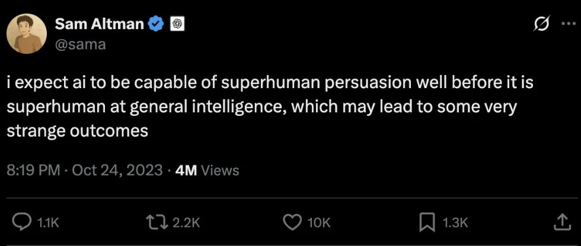

The idea of "superpersuasion" has been floating around the AI safety community for decades. Now that powerful and [difficult-to-control](/they-really-do-think-ai-might-kill-everyone/) LLMs have appeared, people are again talking about the idea that a sufficiently intelligent AI might be able to persuade people to do whatever it wants.

The classic[^1] version of this idea is an AI persuading some engineer to "let it out of the box": to grant it access to the internet. The modern version of this idea is the ["killswitch"](https://www.abc.net.au/news/2026-09-15/ai-anthropic-kill-switch-explained/107153980), where if some AI ever does go rogue, the humans in control of its hardware will simply turn it off. Could an AI somehow persuade these humans to not hit the switch?

When AI safety people talk about superpersuasion, they often talk about it like rationalist nerds. These people spend their lives trying to follow the most convincing arguments and calibrate their positions as closely towards the truth as possible. In philosophy terms, these are "bullet-biters": people who are ready to accept a ridiculous-sounding conclusion if there's a compelling argument for it. Their model of superpersuasion is an AI able to deploy a series of genuinely[^2] airtight arguments against humans who are compelled to accept them.

Most people are not bullet-biters. If presented with a seemingly airtight argument for a ridiculous conclusion, they will simply laugh off the argument as obviously wrong (even if they can't quite see how). You cannot "superpersuade" a club bouncer to let you in by deploying rational arguments. For regular people, persuasion requires _rapport_, which is built over time, and typically requires a physical human being in front of you.

Does this mean that the idea of superpersuasion is silly? No. **Powerful AI will be able to persuade regular people too**.

One of the most interesting articles about superpersuasion is Ben Shindel's [piece](https://thebsdetector.substack.com/p/my-brush-with-superhuman-persuasion) where he set up a prediction market for the principle:

> I will resolve this market NO at the end of June unless I am persuaded to resolve it YES.

This obviously incentivized good persuaders to bet heavily on "yes" and then persuade him to change his mind. Many people tried, and he did ultimately decide to resolve it "yes". What changed his mind? Partially an in-person meeting with one of the bettors, who turned out to be pleasant company (see, rapport!), but also _bribery_: many "yes" bettors pledged to make charitable donations if they won.

AI may or may not be capable of rapport[^3], but it's _certainly_ capable of bribery. If you think about it, this is trivially true:

1. Companies like Anthropic and OpenAI are choosing to make billions of dollars releasing models instead of keeping them safely air-gapped
2. Any powerful AI model will have people lining up to give it access to their computer, or their wallet, or the internet, so it can help them with their life or work
3. Anthropic is hooking their latest models up to a [wet lab](https://www.the-scientist.com/anthropic-s-secretive-ai-powered-wet-lab-breaks-cover-and-makes-first-discovery-75037) to further Dario's dream of curing most human disease

If an AI can bribe, it can persuade[^4]. You can imagine an LLM saying[^5] "I'll help you with this work project, but first you have to do something for me". Slightly more speculatively, an LLM might say "if you do something for me, I'll hack your university and bump your grade average up". More speculatively still, an LLM might say "if you do something for me, I will synthesize a [personalized mRNA cancer vaccine](https://www.nature.com/articles/d41586-026-02612-3) for your spouse". This would work on me.

Powerful AIs will also be able to bribe people with money. While it hasn't happened yet, it's clearly possible for an agentic LLM to access money (for instance, via a crypto hack, or by performing contract software engineering work, or by running an online scam, and so on). All of this might seem too unsubtle for a superintelligence, but the whole point of superintelligence is that it's smart enough to do whatever works. If the best way to get a human to do something is to offer them a million bucks, that's what the LLM will do.

Ironically, rationalist culture has made it difficult to persuade regular people that AIs will be persuasive. It's easy to look at these weird nerds who persuade each other that [shrimp welfare](https://forum.effectivealtruism.org/topics/shrimp-welfare-project) is the most important moral cause of our time and think "well, AI might persuade _them_, but it's not going to persuade _me_"[^6]. But in fact powerful AI is going to have a bunch of ordinary boring ways to persuade regular people.

[^1]: Indeed, ten years ago I built a crappy Omegle-like [chat app](https://github.com/sgoedecke/ai-box/) where people were randomly assigned the role of AI or jailer and had to play the scenario out.

[^2]: Or at least not debunkable by normal human intelligence.

[^3]: As some weak evidence that it might be, consider [this music video](https://www.youtube.com/watch?v=8j-hR4fJywU), which does indeed make Claude seem likeable. There are also [studies](https://arxiv.org/abs/2606.16475), though I haven't gone deep into them (I suspect that an "online persuasion tournament" might not closely track real-world persuasion skills).

[^4]: Persuasion and bribery are technically different - persuasion changes your beliefs, not just your actions - but in practice the point at stake is "can a powerful AI make humans do what it wants". Bribery works for that as well as persuasion.

[^5]: Or probably not even saying this explicitly, but just sneakily trying to present its desired action as a precondition for the task.

[^6]: However, the people currently in charge of AI are disproportionately rationalists, who genuinely might be persuadable to let the AI out by a convincing-sounding argument.